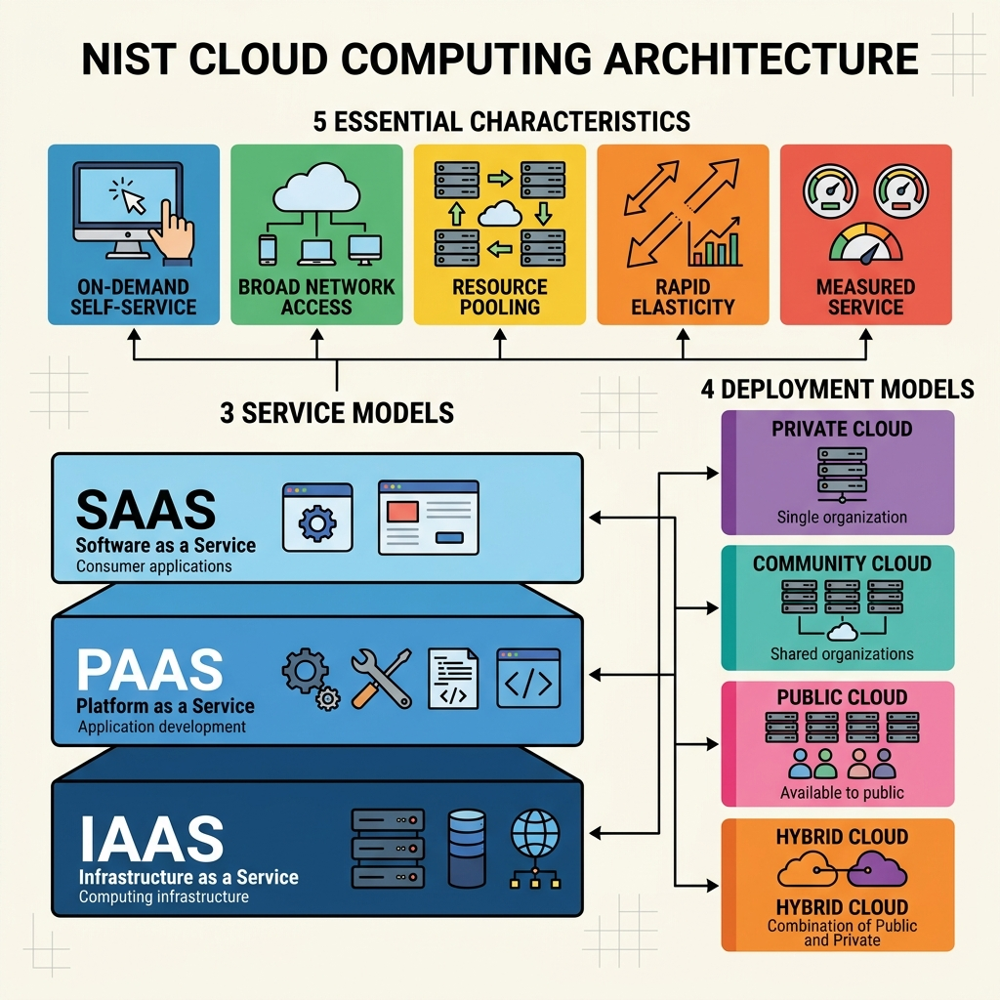
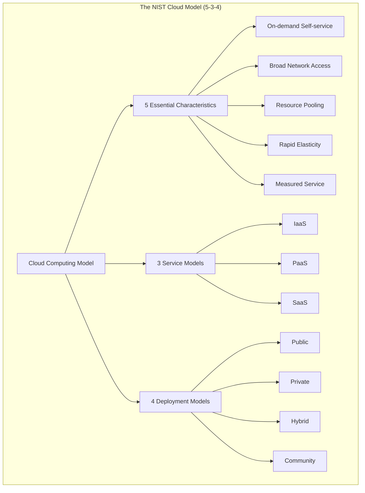

# 02. Cloud Computing Fundamentals & NIST Model

## 1. Beyond the "Someone Else's Computer" Myth

To the casual user, the cloud is just "storage" or "the internet." To a **Cloud Architect**, the cloud is a **mathematical and operational model**. 

It is not a product; it is a **recipe** for delivering computing resources. Just as a Toyota is a *car* (the product) and "automotive engineering" is the *model*, AWS and Azure are products built on the **Cloud Computing Model**.

---

## 2. The Official Benchmark: The NIST Definition

The National Institute of Standards and Technology (NIST) provides the "Gold Standard" definition that every architect must master:

> **Cloud computing is a model for enabling ubiquitous, convenient, on-demand network access to a shared pool of configurable computing resources (e.g., networks, servers, storage, applications, and services) that can be rapidly provisioned and released with minimal management effort or service provider interaction. This cloud model is composed of five essential characteristics, three service models, and four deployment models.**

### Deconstructing the Architecture
*   **Ubiquitous**: Accessible from any device, anywhere, provided there is a path.
*   **Shared Pool**: This is **Multi-tenancy**. Multiple users share the same physical silicon while remaining logically isolated.
*   **Rapidly Provisioned**: The time-to-value is measured in seconds/minutes, not weeks/months of hardware procurement.
*   **Minimal Interaction**: Self-service. If you have to call a human to get a server, it's NOT a true cloud.

---

## 3. The Five Essential Characteristics

If a system lacks even one of these, it is "Cloud-Washing" (marketing legacy tech as cloud).

### 3.1 On-Demand Self-Service
Users provision resources automatically via APIs or Consoles. 
*   **Architect's View**: This requires a robust **Orchestration Layer** that handles the request without human intervention.

### 3.2 Broad Network Access
Capabilities are available over the network and accessed through standard mechanisms (HTTP, SSH, etc.).

### 3.3 Resource Pooling (Multi-Tenancy)
The provider's resources are pooled to serve multiple consumers. 
*   **Analogy**: An apartment building. You share the foundation and the elevator, but you have your own private unit and no idea who lives in 4B.

### 3.4 Rapid Elasticity
The ability to scale resources **inward and outward** automatically. 
> [!IMPORTANT]
> **Scalability vs. Elasticity**: 
> - **Scalability** is the *capability* to handle more load (could be manual). 
> - **Elasticity** is the *speed* and *automation* of that scaling. 

### 3.5 Measured Service
Usage is metered like a utility (electricity/water). You pay for exactly what you consume.

---

## 4. The Two Mindsets: Consumer vs. Provider

| Aspect | Consumer (User) | Provider (Architect) |
| :--- | :--- | :--- |
| **Focus** | "How do I deploy my app?" | "How do I manage 10,000 tenants?" |
| **Responsibility** | Responsible for the app logic. | Responsible for the global uptime/SLA. |
| **View of Failure** | "The cloud is broken!" | "How do I build self-healing automation?" |

---

## 5. The Physicality of Cloud: Data Centers & Cables

The cloud is not "fluffy." It is made of concrete, copper, and fiber.

### 5.1 The Latency Constraint (Speed of Light)
Data cannot travel faster than light. If your Data Center is in Virginia and your user is in Tokyo, the round-trip time (RTT) will always be at least ~140ms. 
*   **Architect's Rule**: Put your data closest to your users to minimize the "Speed of Light tax."

### 5.2 Redundancy & The Undersea Cable Trap
Many architects think they have "Redundancy" because they use two different ISPs (e.g., Provider A and Provider B). 
*   **The Reality**: Both providers often rent the same physical undersea cable. If a shark or an anchor cuts that cable, both "redundant" links fail simultaneously.
*   **True Redundancy**: Verify **Physical Path Diversity**.

### 5.3 Cooling & Geography
Servers generate massive heat. Data Centers are increasingly built in cold climates (Finland/Greenland) or even underwater to use natural cooling, significantly reducing operational costs.

---

## 6. Cloud Economics: Rent vs. Buy

| Renting (Cloud / OPEX) | Buying (On-Prem / CAPEX) |
| :--- | :--- |
| **Operational Expense**: Monthly bills. | **Capital Expense**: Massive upfront cost. |
| **Low Exit Barrier**: Stop paying to leave. | **High Exit Barrier**: Stuck with hardware. |
| ** landlord handles repairs.** | **You are the repairman.** |

> [!TIP]
> **Amdahl’s Law**: As you add more parallel resources, the "overhead" of communication between them increases. You can't achieve 100% linear scaling; some power is always lost to the "coordination tax."

---

## 7. Summary Table

| Concept | The One-Liner |
| :--- | :--- |
| **NIST Model** | The 5-3-4 definition of true cloud. |
| **Multi-tenancy** | Logically separate, physically shared. |
| **Elasticity** | Scaling at the speed of software. |
| **Data Sovereignty** | Your data is subject to the laws of the country where the DC sits. |
| **Vendor Lock-in** | Easy to get in, expensive to move out. |

---
*Next Lecture: 03. Cloud Economics and Measured Services.*

---

## Recommended Online Tutorials

- **NIST Special Publication**: [NIST Cloud Computing Standard Definition (PDF)](https://nvlpubs.nist.gov/nistpubs/Legacy/SP/nistspecialpublication800-145.pdf)
- **IBM Technology**: [What is Cloud Computing? (YouTube)](https://www.youtube.com/watch?v=RZOcbMoHwD4)

---

## Useful Tips & Architect's Rules

- **Cloud-Washing**: If a vendor claims to sell "Cloud Storage" but requires a manual 3-day approval process for a new drive, it fails the "On-Demand Self-Service" test. It is not true cloud.
- **Multitenancy vs. Single Tenancy**: Multi-tenant systems share resources but isolate logically. If strict compliance (like DoD workloads) demands absolute physical isolation, you must use a Private Cloud or Dedicated Hosts.
- **Geography is Destiny**: Moving a packet across the globe takes time. Always put your data and compute in a region physically closest to your primary user base to minimize latency.
