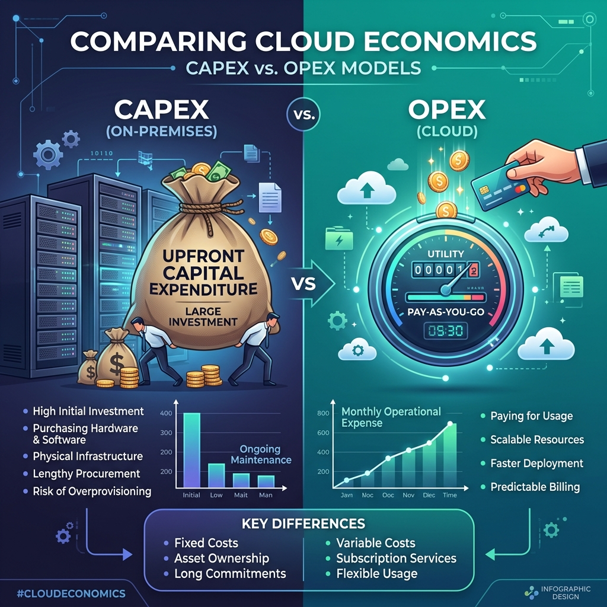

# Understanding Cloud Computing: Measured Services, Network Costs, and Resource Optimization

*A practical guide for cloud engineers and architects*

---

## Introduction


Cloud computing promises “pay-as-you-go” — but how do providers actually measure your usage? And more importantly, how can you avoid unexpected bills while designing scalable systems?

This tutorial explains the fifth essential characteristic of cloud computing: **measured service**. You’ll learn how compute time is measured, why network costs can double unexpectedly, what limits real‑world connections, and how different stakeholders view cloud characteristics.

By the end, you’ll think like a cloud provider, not just a user.

---

## Part 1: The Measurement Challenge

### Why “counting requests” fails

Imagine you rent out computing power on a pay‑as‑you‑go model. How do you decide how much each customer consumes?

A natural first idea: **count the number of requests**.

But consider two types of workloads:

| Workload Type | Example | Request duration |
|---------------|---------|------------------|
| Short‑lived / stateless | Checking email, loading a webpage | Milliseconds |
| Heavy analytics | Running a year‑end sales report | Minutes to hours |

If you charge by request, the heavy analytics user pays the same as the light user — even though they consume thousands of times more CPU cycles. That’s neither fair nor sustainable.

### The industry solution: service time

Cloud providers charge for **service time** — the duration your resource (e.g., a virtual machine) remains active, regardless of whether it is doing useful work.

> **Key principle:** You are billed for the time the service is running, not only for the CPU cycles you actively use.

**Analogy – A gym membership**  
You pay for access to the gym (service time). Whether you lift weights for two hours or sit in the lobby scrolling your phone, the monthly fee is the same. If you forget to cancel, you keep paying.

**Practical takeaway:** Always stop or terminate virtual machines when you are done. A “running but idle” VM costs you real money.

---

## Part 2: How Does an Operating System Measure CPU Time?

To understand measured service, you need to know how CPU time is actually measured under the hood.

### The epoch timestamp

Every modern operating system maintains an **epoch time** — the number of nanoseconds (or microseconds) since a fixed date (e.g., January 1, 1970). In Linux, you can retrieve this timestamp with system calls like `clock_gettime()`.

**Pseudo‑code for measuring a function’s execution time:**

```
start = get_epoch_timestamp()
execute_the_work()        // the code you want to measure
end = get_epoch_timestamp()
elapsed = end - start
```

### The observer effect

Here is the subtle problem: **measuring time consumes CPU time**.

```
Original work:     100 instructions
Measurement code:  200 instructions (start, end, subtraction)
Total executed:    300 instructions
```

You are now measuring 300 instructions, but only 100 were the actual work. The act of observation changes the system.

**Analogy – A cooking show**  
Imagine you are a food critic timing a chef. Every time you start your stopwatch, you also have to stir your own sauce. Your presence alters what you are measuring.

In a datacenter, accurately measuring every customer’s CPU usage would require dedicated CPU cores just for the measurement — increasing costs for everyone.

### How real cloud providers handle this

Because fine‑grained measurement is expensive, most providers use a simpler model:

> **Bill based on service time (how long the VM is in the “running” state), not on actual CPU utilization.**

That is why a forgotten VM running idle for a month can generate a surprisingly large bill.

---

## Part 3: Network Costs – The Hidden Double Charge

Data transfer is often the most misunderstood part of a cloud bill.

### A simple download scenario

Assume 1 KB of data transfer costs 1 unit. You want to download a 1 GB file. How many units does the **total system** pay?

**Wrong intuition:** 1,000 units (because 1 GB = about 1,000 KB).

**Correct answer:** Roughly **2 × (1 GB in KB)**, plus extra for network errors.

### Why double? The two‑sided nature of transfer

Every download involves two parties:

- **Server side** – pays for *uploading* the data onto the network.
- **Client side** – pays for *downloading* the data from the network.

When a company uses a cloud service for **internal employees only** (both server and client belong to the same organisation), the organisation pays twice: once for upload and once for download.

**Real‑world example – An online ticketing system**  
- The ticket provider (e.g., a railway or airline) pays for its servers to upload ticket data.  
- You, as a customer, pay your own internet provider for downloading that data.  
- The provider does **not** pay for your download.

But if the same company runs an internal employee portal on the cloud, they pay both sides.

### Wireless errors add even more cost

Wireless networks are not perfect. When a packet is corrupted, it must be resent. Your data meter keeps running during retransmissions.

| Network type | Typical efficiency | For 1 GB download, you pay for |
|--------------|-------------------|--------------------------------|
| 5G | ~90‑95% | ~1.1 GB |
| 4G | ~75‑85% | ~1.3‑1.4 GB |
| 2G / EDGE | ~50‑60% | ~2 GB |

**Analogy – Mailing a book**  
You send a 10‑page document. If pages get smudged and must be re‑sent, the postal service charges for every attempt. Both sender and recipient pay for their own side of the delivery.

> **Design rule for cloud architects:** Always account for network egress costs and retransmission overhead. They can easily double your expected networking bill.

---

## Part 4: Socket Limits – Theoretical vs. Practical

When you design a scalable service, you will eventually hit connection limits. Understanding the gap between theory and practice is critical.

### The theoretical limit

A socket is identified by an IP address and a port number. The port field is 16 bits → **65,536 possible ports**. In theory, you could open 65,536 simultaneous sockets.

### The practical limit on commodity hardware

Real laptops and servers cannot sustain that many concurrent connections. Practical tests show:

- **~17‑37 simultaneous active connections** on a standard single‑NIC machine.
- Beyond that, performance degrades sharply, and new connections may be refused.

**Real‑world experiment – A Wi‑Fi router**  
- 17‑18 connected devices → good service.  
- 30‑35 devices → noticeable delays.  
- 37+ devices → new devices cannot connect.

**Bluetooth comparison**  
Bluetooth has a theoretical limit of 8 devices. In practice:  
- 3 devices → reliable.  
- 4 devices → borderline.  
- 5+ devices → very unreliable.

### What this means for cloud applications

If your service specification says “supports 1,000 simultaneous users”, you cannot rely on a single virtual machine with one virtual NIC. You will need:

- Multiple VMs on different physical hosts.
- Each with its own NIC (or multiple NICs).
- Load balancing across them.

> **“Simultaneous” means at the exact same millisecond, not over a 10‑minute window.**

---

## Part 5: Who Cares About Which Characteristic?

Cloud characteristics matter differently to different stakeholders. Let’s define three roles:

| Role | Description | Example |
|------|-------------|---------|
| **Service Provider** | Owns and operates the infrastructure | Cloud vendor (e.g., AWS, Google Cloud) |
| **Client** | Pays for the service | A company that buys cloud resources |
| **User** | Actually uses the service | Employees or customers of the client |

### Mapping characteristics to stakeholders

| Characteristic | Primary stakeholder | Why? |
|----------------|---------------------|------|
| **On‑demand self‑service** | Client | Client needs to provision resources without calling support every time. |
| **Broad network access** | User | Users expect to connect from any device, anywhere. |
| **Resource pooling** | Service Provider | Provider maximizes profit by sharing physical resources among many clients. |
| **Rapid elasticity** | Client & Provider | Client needs automatic scaling; Provider must enable it. |
| **Measured service** | Client & Provider | Both care about the financial model – what to charge and what to pay. |

### The birth of cloud computing – a story from Amazon

Amazon started as an e‑commerce platform. They built massive data centers, but at night almost nobody was buying. Their utilisation was **below 20%** – they were paying 100% of the electricity and maintenance costs for only 20% useful work.

**The insight:** “Can we rent out the other 80% to other companies?”

That insight led to Amazon Web Services (AWS). They used **virtualization** to isolate customer workloads from Amazon’s own e‑commerce systems, turning idle capacity into a profitable business.

### Resource pooling optimisation

Smart resource pooling means co‑hosting workloads that complement each other:

| Workload type | Good pairing | Bad pairing |
|---------------|--------------|--------------|
| Compute‑intensive (e.g., financial analytics) | I/O‑intensive (e.g., video streaming) | Another compute‑intensive job → CPU contention |
| I/O‑intensive (e.g., database) | Compute‑intensive | Another I/O‑intensive job → I/O bottleneck |

The better a provider can pool diverse workloads, the lower their costs – and the lower your bill.

---

## Part 6: Service Models – IaaS, PaaS, SaaS

Cloud services are commonly divided into three models.

| Model | Stands for | What you get | Example |
|-------|------------|--------------|---------|
| **IaaS** | Infrastructure as a Service | Virtual machines, storage, networks, firewalls | AWS EC2, Google Compute Engine |
| **PaaS** | Platform as a Service | Operating system, runtime, middleware, databases | Google App Engine, Heroku |
| **SaaS** | Software as a Service | Complete applications, ready to use | Gmail, Google Drive, Netflix |

### The “OS or not?” question for IaaS

**Question:** Does Infrastructure as a Service require an operating system?

**Answer:** At minimum, you need a **kernel** – a collection of device drivers to access hardware interfaces. That kernel plus VM management is called **bare‑metal virtualization (Type 1)**.

- **Type 1 (bare metal)** – runs directly on hardware, no host OS. More efficient, used by professional cloud providers.
- **Type 2 (hosted)** – runs on top of an existing OS (e.g., VirtualBox, VMware Workstation). Simpler for learning.

### The folder‑and‑process mental model

> **A virtual machine is a folder containing files that describe its configuration. When those files are executed, the VM becomes a process on the host operating system.**

| State | What it means |
|-------|----------------|
| Stopped VM | Files on disk (like a saved game) |
| Running VM | A process in memory (like an active game) |

Each running VM is one process on the host – a special process, but still a process.

---

## Summary – The Five Essential Characteristics

| Characteristic | Simple definition | Real‑world implication |
|----------------|------------------|------------------------|
| **On‑demand self‑service** | You provision resources yourself, without human intervention | No phone calls, no waiting |
| **Broad network access** | Accessible from any device (phone, laptop, tablet) over the network | Works everywhere |
| **Resource pooling** | Physical resources are shared among multiple customers | Lower cost per customer |
| **Rapid elasticity** | Resources scale up and down automatically, sometimes within seconds | No need to over‑provision |
| **Measured service** | Usage is metered and billed | Pay only for what you use (but remember: service time, not only active time) |

---

## Key Takeaways – To Remember Forever

1. **Cloud bills charge service time, not only active CPU time** – stop idle resources.

2. **Network cost is double** – the server pays for upload, the client pays for download.

3. **Wireless errors add overhead** – 1 GB download can cost 1.3 GB on 4G, nearly 2 GB on 2G.

4. **Practical socket limits are far lower than theoretical** – plan for ~20 simultaneous connections per NIC, not 65,535.

5. **Resource pooling is the provider’s main profit lever** – it allows them to offer low prices.

6. **A VM is a folder that becomes a process** – this mental model will help you debug and optimise.

7. **Cloud computing was born from idle data centers** – necessity drove innovation.

---

## Self‑Check Questions

1. You launch a VM at 9:00, run a 1‑hour computation at 10:00, then forget to turn it off until 18:00. What are you billed for?  
   *Answer: 9 hours of compute service time.*

2. A company runs an internal file server on the cloud. Employees download a 500 MB file. Who pays for the upload? Who pays for the download?  
   *Answer: The company pays for both – the cloud provider charges for upload from the server, and the company’s own internet connection pays for the download.*

3. Can a single VM realistically handle 10,000 simultaneous WebSocket connections?  
   *Answer: No – practical limits are ~20‑30 truly simultaneous connections per NIC. You need multiple VMs and a load balancer.*

---

## Recommended Online Tutorials

- **TechTarget**: [Cloud Economics (CAPEX vs OPEX)](https://www.youtube.com/watch?v=B7bXkE_ZtPE)
- **AWS**: [AWS Cloud Financial Management (FinOps)](https://aws.amazon.com/cloud-financial-management/)

---

## Useful Tips & Architect's Rules

- **The %st (Steal Time) Metric**: In a multi-tenant cloud environment, "CPU Steal Time" tells you how much your virtual CPU has to wait for the physical CPU. If `%st` spikes, you have a noisy neighbor.
- **The Egress Trap**: Cloud providers make inbound data free but charge heavily for outbound data (egress). Always architecture your data gravity to pull data into the cloud, process it there, and only egress the small summary results.
- **Spot Instances**: If your workload is stateless and can tolerate random shutdown, use Spot/Preemptible instances. It's the same physical hardware but 70-90% cheaper.