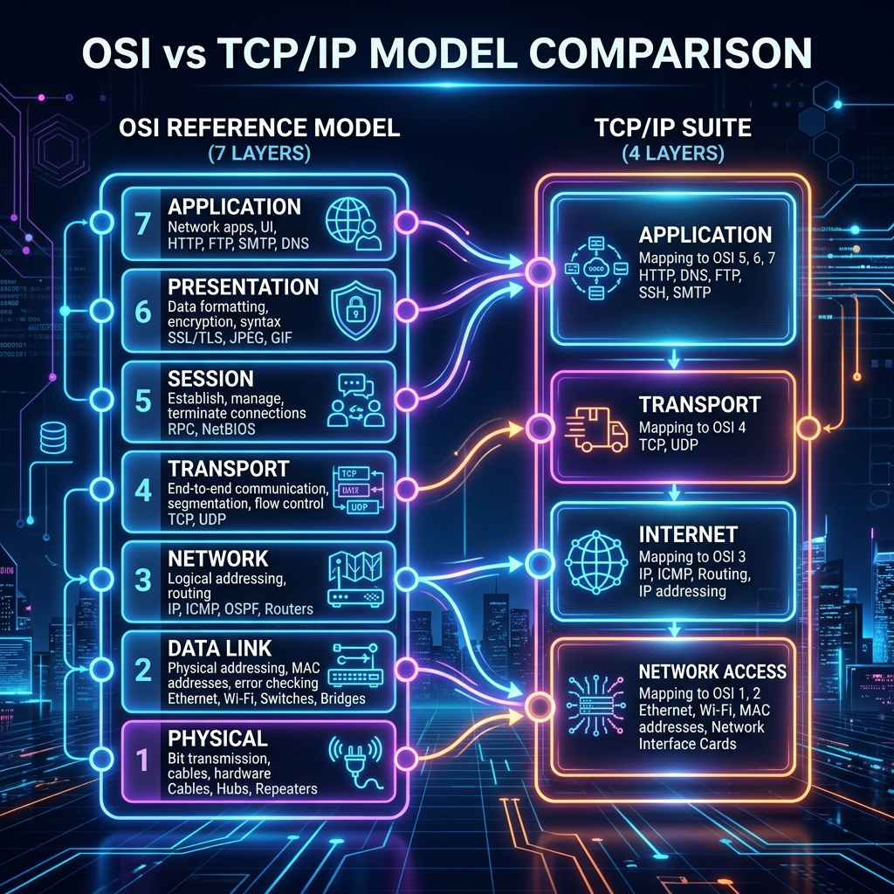
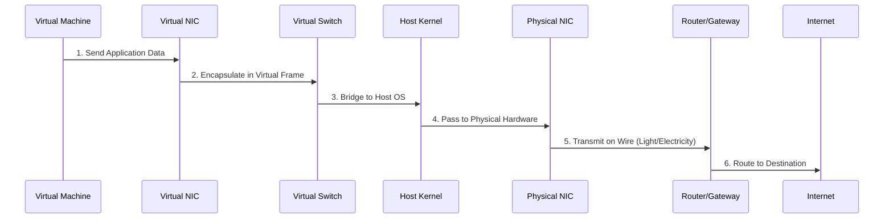

# Understanding Network Fundamentals: A Complete Beginner's Guide

This tutorial covers everything you need to know about IP networks before diving into network virtualization. No prior networking experience required.

---

## What You'll Learn

- What IP addresses are and why they matter
- How port numbers help identify specific applications
- The difference between static and dynamic IP addresses
- How switches, routers, and gateways work together
- What subnets, firewalls, and DMZs do

Let's start from the ground up.

---

## 1. IP Addresses: The Foundation

### What is an IP Address?

An **IP address** (Internet Protocol address) works like a postal address for your device. When you send or receive data over the internet, the IP address tells the network where to deliver that data.

**Format:** Four numbers separated by dots, each between 0 and 255.

```
Example: 192.168.1.1
         │  │  │  │
         └──┴──┴──┴── Each part = 0–255
```

**Technical details:**
- Each part is 8 bits (binary number)
- Total size: 32 bits
- Total possible addresses: about 4.3 billion

### Why Do We Need IP Addresses?

Imagine sending a letter without a return address or destination address. The postal service wouldn't know where to deliver it or where to send a reply. The internet works the same way. Every device needs a unique identifier so data knows where to go.

> **Key point:** An IP address uniquely identifies a device on the internet.

---

## 2. Port Numbers: Finding the Right Application

### The Problem

Your computer runs multiple apps at once. How does incoming data know which app to go to? Your browser, email client, music player, and video call software all receive data simultaneously.

### The Solution: Port Numbers

Think of an **IP address** as an apartment building address, and a **port number** as the specific apartment number. Both are needed for delivery.

**Format:** `IP_address:port_number`

```
Example: 192.168.1.1:80
         └─┬─┘ └┬┘
        Building Apartment
```

### How Ports Work in Practice

**On your device (client side):**
- Each browser tab uses a different port
- Your email client uses a different port
- Your music streaming app uses another

When data arrives, your operating system reads the port number and routes the data to the correct application.

**On a server side:**

| Application | Port | How to Access |
|-------------|------|----------------|
| Web server A | 80 | `http://server-ip` |
| Web server B | 8080 | `http://server-ip:8080` |
| File transfer (FTP) | 21 | `ftp://server-ip` |
| Secure web (HTTPS) | 443 | `https://server-ip` |

Both web servers run on the same machine simultaneously, differentiated only by port number.

### Technical Limits

- Maximum ports: 65,535 (16-bit number)
- Ports are managed by your operating system
- In practice, a typical laptop handles around 35 simultaneous active ports

---

## 3. Static vs. Dynamic IP Addresses

### Static IP Addresses

**Analogy:** Your permanent home address. It never changes, even when you're away.

**When to use:**
- Public websites and services
- Servers that need to be found reliably
- Any device that must have a consistent address

**Example:** A company's public web server has a static IP so customers always find it.

### Dynamic IP Addresses (DHCP)

**Analogy:** A hotel room. You get a different room each time you check in. When you leave, that room becomes available for someone else.

**When to use:**
- Mobile phones and laptops
- Home internet connections
- Large organizations with many devices

**How it works:**
1. A pool of available IP addresses is maintained
2. When you connect, you receive an available IP
3. When you disconnect, the IP returns to the pool
4. Your IP may change when:
   - You reconnect after disconnecting
   - A time limit (lease) expires
   - You move to a different location

> **DHCP** = Dynamic Host Configuration Protocol – the system that assigns dynamic IP addresses

### Public vs. Private IP Addresses

| Type | Visibility | Usage | Example |
|------|------------|-------|---------|
| Public | Visible worldwide | Websites, public servers | 8.8.8.8 (Google DNS) |
| Private | Visible only inside your network | Home devices, office computers | 192.168.1.x |

**How organizations handle many devices with few public IPs:**
```
Public IPs (5–10 addresses) → Router → Thousands of private IPs (assigned dynamically)
```

---

## 4. Switches: Connecting Devices Within a Network

### The Problem Without Switches

To connect `n` devices directly to each other, you need `n × (n-1) / 2` cables.

| Devices | Cables Required |
|---------|-----------------|
| 4 | 6 |
| 10 | 45 |
| 100 | 4,950 (impossible to manage) |

### How a Switch Solves This

A switch acts as a central connection point. Every device connects to the switch, and the switch forwards data only to the intended recipient.

**Analogy - Office Mailroom:**
- Without mailroom: Every employee personally delivers messages to every other employee
- With mailroom: Everyone drops messages at a central desk; the clerk delivers each message to the right person

**How it works:**
```
Device A → Switch reads destination address → Forwards only to Device B
```

### Switch Technical Details

| Property | Description |
|----------|-------------|
| OSI Layer | Layer 2 (Data Link Layer) |
| Understands | MAC addresses (hardware addresses) |
| Scope | Works within a single network |
| Decision type | Switching (intelligent forwarding to specific destination) |

### The OSI Layer Model (Simplified)

Think of networking layers like floors in a building:



| Layer | Name | Device | Understands |
|-------|------|--------|--------------|
| Layer 1 | Physical | Cable, Hub | Electrical signals only |
| Layer 2 | Data Link | **Switch** | MAC addresses |
| Layer 3 | Network | **Router** | IP addresses |
| Layer 4 | Transport | Your computer | Port numbers |

> **Key insight:** A switch only has layers 1 and 2. It doesn't understand IP addresses or ports – only MAC addresses.

---

## 5. Subnets: Organizing Networks

### What is a Subnet?

A **subnet** (short for "subnetwork") is a smaller network inside a larger one where devices can communicate directly without going through a router.

**Analogy - A Large Office Building:**
- The entire building = one large network
- Floor 1 (Sales department) = one subnet
- Floor 2 (Engineering department) = another subnet
- A specific team's corner on Floor 2 = a nested subnet

### Subnet Rules

| Within the same subnet | Between different subnets |
|------------------------|---------------------------|
| Devices can reach each other directly using IP addresses | Devices need a router to communicate |
| No router required for internal communication | Router required |

### Subnet Masks

A **subnet mask** tells you which part of an IP address identifies the network and which part identifies the specific device.

**Example:** Subnet mask `255.255.255.0` means:
- First three numbers = Network part (like area code)
- Last number = Device part (like local number)

```
IP address:     192.168.1.100
Subnet mask:    255.255.255.0
Network part:   192.168.1
Device part:    100
```

### Maximum Devices in a Subnet

The limit depends on how many bits are reserved for device addresses. With `255.255.255.0`, you have 8 bits for devices = 256 possible addresses (some reserved for special purposes).

### Nested Subnets

You can have subnets inside subnets (like rooms inside floors). Within the same larger subnet, switches can connect nested subnets – you don't always need a router.

---

## 6. Routers: Connecting Different Networks

### Router vs. Switch – The Critical Difference

| Feature | Switch | Router |
|---------|--------|--------|
| Layer | Layer 2 | Layer 3 |
| Understands | MAC addresses | IP addresses |
| Decision making | Simple forwarding | Intelligent routing with policies |
| Scope | Within one network | Between different networks |
| Analogy | Mailroom clerk who knows the building | Post office routing between cities |

### How Routing Works – Following a Web Request

Let's trace what happens when you type a website name into your browser:

**Step 1:** Your device creates a request packet for `www.example.com`

**Step 2:** Since the destination is outside your subnet, the packet goes to your router

**Step 3:** The router checks its **routing table** – a map that knows which direction leads to which networks

**Step 4:** The router contacts a **DNS server** (Domain Name System) to find the IP address for `www.example.com`

**Step 5:** DNS responds: "`www.example.com` is at IP `93.184.216.34`"

**Step 6:** Your router forwards the request to that IP address

**Step 7:** The response travels back through multiple routers to reach you

### Router as Traffic Police

**Analogy:**
- **Router** = Traffic police officer at an intersection who decides which way each car should go based on destination
- **Switch** = A simple conveyor belt that moves items but doesn't make routing decisions

### Forwarding vs. Switching

| Operation | What it does | When used |
|-----------|--------------|-----------|
| **Switching** | Sends packet ONLY to the correct destination | Normal network operation |
| **Broadcasting** | Sends packet to ALL destinations | Discovery protocols, announcements |

> **Note:** This is different from "port forwarding" – that's a separate concept we'll cover later.

---

## 7. Gateway: The Door to the Outside World

### What is a Gateway?

A **gateway** is the IP address that devices use to reach networks outside their own. It's the "door to the outside world."

**Analogy - Building Main Entrance:**
- The building's street address is what the public uses to send mail
- The main entrance is the gateway into the building

### Gateway vs. Router – The Relationship

**Common question:** Is a gateway different from a router?

**Answer:** A **gateway** is a **logical address** (usually the router's IP address). The **router** is the physical device that has that address.

When you configure network settings and see "Gateway IP address" – that's your router's address.

**Example network configuration:**
```
Device IP:      192.168.1.100
Subnet mask:    255.255.255.0
Gateway:        192.168.1.1   ← This is your router's address
```

### Can a Gateway Be a Separate Device?

Yes, if you add extra functionality:
- Firewalls
- Proxy servers
- Security filtering
- Traffic logging

In those cases, you might have a dedicated gateway device. But logically, the gateway is still just an IP address that belongs to the network.

---

## 8. Firewall: Controlling Network Traffic

### What is a Firewall?

A **firewall** restricts network traffic based on rules – it decides what is allowed and what is blocked.

**Analogy - Building Security Guard:**
- No security: Anyone can walk into any office
- With a guest list: Guard checks IDs; only approved visitors enter
- Strict security: Guard blocks everyone unless explicitly approved

### How Firewalls Work (Default-Deny Approach)

The most secure configuration starts with **everything blocked**, then explicitly allows only what's needed.

**Example – A Web Server:**

Your server runs three services:
- Web server on port 80
- File transfer (FTP) on port 21
- Database on port 3306

Firewall rule: `ALLOW incoming traffic on port 80`

| Traffic type | Result |
|--------------|--------|
| Web requests on port 80 | ✅ Allowed |
| FTP requests on port 21 | ❌ Blocked |
| Database requests on port 3306 | ❌ Blocked |

### What a Firewall Examines

The firewall looks at the **IP packet header**, which contains:
- Source IP address
- Source port number
- Destination IP address
- Destination port number
- Packet type (unicast, multicast, broadcast)

### Inbound vs. Outbound Rules

You can configure different rules for:
- **Inbound traffic:** Coming INTO your network (external access attempts)
- **Outbound traffic:** Going OUT of your network (your devices accessing external sites)

**Example:** Block all outbound traffic on port 25 (email) to prevent malware from sending spam, while still allowing inbound email on port 25 from trusted sources.

### Firewall Limitations

A firewall is **not complete security**. It only protects at the IP layer.

| Attack Type | Description | Firewall prevents? |
|-------------|-------------|---------------------|
| SQL Injection | Malicious code in database queries | ❌ No |
| Man-in-the-Middle | Attacker intercepts communication | ❌ No |
| DDoS | Overwhelming server with traffic | Partially |
| SSL/TLS attacks | Exploits in encryption protocols | ❌ No |

> **Remember:** Firewall = IP layer security. Application-level attacks require additional protections like Web Application Firewalls (WAF).

---

## 9. DMZ: Handling Unknown Traffic

### The Problem

What happens when a request arrives and your firewall doesn't have a rule for it?
- Allow it? (security risk)
- Block it? (might block legitimate traffic)
- Ignore it? (packet just sits there)

### Solution: DMZ (Demilitarized Zone)

A **DMZ** is a neutral zone where unhandled requests go – partially open to the public but separated from your internal secure network.

**Analogy - Office Reception Area:**
- **Internal offices** = Secure network (employees only)
- **Reception/waiting area** = DMZ (anyone can enter)
- **Security guard** = Firewall

Unknown visitors wait in reception. They cannot enter the internal offices. You can choose to serve them in reception or ignore them.

### DMZ Architecture

```
Internet → Firewall → DMZ (Public-facing servers)
                ↓
          Internal Secure Network
```

**Key points:**
- DMZ is **not behind the main firewall** – it's a separate zone
- DMZ is open to public access
- Internal network remains protected
- Unhandled requests are redirected to DMZ

### When to Use a DMZ

**Scenario:** You run a public web server (anyone can access) plus an internal database that should NEVER be exposed to the internet.

**DMZ Solution:**
- Web server → Placed in DMZ (public can reach it)
- Database → Internal network (no direct internet access)
- Firewall rules allow web server to query database (controlled, one-way communication)

---

## 10. Putting It All Together

### Complete Request Flow

Let's trace a request from your device to a website and back:

```
Your device (192.168.1.100) wants to visit www.example.com

1. Your device: "Is www.example.com in my subnet?"
   No → Send to GATEWAY (192.168.1.1)

2. ROUTER at gateway: Checks routing table
   "www.example.com → need DNS lookup"

3. DNS SERVER: "www.example.com = 93.184.216.34"

4. ROUTER: Forwards request to that IP
   Packet travels through multiple routers across the internet

5. DESTINATION FIREWALL: "Port 80 (web) is allowed. Let it through."

6. DESTINATION SERVER: Processes request and sends response

7. RESPONSE travels back through routers → your router → your switch → your device

8. YOUR FIREWALL: "Response matches my request. Allowed."

9. YOUR OPERATING SYSTEM: Reads port number → Routes to correct application

10. You see the webpage!
```

### Summary Table

| Component | Layer | Purpose | Best Analogy |
|-----------|-------|---------|---------------|
| IP Address | 3 | Identifies device | Street address |
| Port Number | 4 | Identifies application | Apartment number |
| Switch | 2 | Connects devices in same network | Mailroom clerk |
| Router | 3 | Connects different networks | Traffic police |
| Gateway | 3 | Exit door to outside | Main gate address |
| Firewall | 3-4 | Filters traffic | Security guard with guest list |
| DMZ | - | Neutral public zone | Reception area |
| Subnet | - | Devices that can talk directly | Neighborhood |

## The Journey of a Packet: From VM to the Internet

Understanding the physical and virtual handshakes is key for any cloud architect.



---

## 10. Summary & Key Takeaways

1. **IP Address + Port = Complete destination** – like a building address plus apartment number

2. **Switches work inside networks; routers connect networks**

3. **Firewalls deny by default, allow only when explicitly configured**

4. **A gateway is just an IP address** (usually your router's address)

5. **Dynamic IP = Hotel room; Static IP = Your home**

6. **DMZ = Waiting room for unknown visitors**

7. **Each layer understands only its own language:**
   - Layer 2 (Switch) → MAC addresses
   - Layer 3 (Router) → IP addresses
   - Layer 4 (Your device) → Port numbers

---

## Practice Exercises

Try these to reinforce your understanding:

1. **Find your IP address** using `ipconfig` (Windows) or `ifconfig`/`ip addr` (Linux/Mac)

2. **Check if your IP changes** at different times or on different networks

3. **Identify these common port numbers:**
   - Port 80
   - Port 443
   - Port 21
   - Port 22
   - Port 25

4. **Draw your home network** showing all devices, your router/switch, and where the gateway sits

5. **Explain to someone** the difference between a switch and a router using the mailroom vs. post office analogy

---

## Next Steps

Now that you understand physical network fundamentals, you're ready to learn about **network virtualization** – how we create software versions of switches, routers, and firewalls to enable cloud computing and virtual networks.

---

## Recommended Online Tutorials

- **NetworkChuck**: [You need to learn the OSI MODEL right now! (YouTube)](https://www.youtube.com/watch?v=k_ZqAILx4K0)
- **PowerCert Animated Videos**: [Hub, Switch, & Router Explained (YouTube)](https://www.youtube.com/watch?v=1z0ULvg_vdQ)

---

## Useful Tips & Architect's Rules

- **The Subnet Math Rule**: The network `10.0.0.0/24` has 256 addresses total. In AWS, you lose 5 IP addresses per subnet immediately (Network Address, Broadcast, plus 3 AWS reserved ones). Always account for this when sizing subnets.
- **NAT Gateways**: In cloud environments, you rarely use standalone public IPs for databases. You keep them in private subnets, and if they need to fetch an update, they use a Network Address Translation (NAT) Gateway to speak to the internet without allowing inbound internet requests.
- **CIDR Blocks**: Learn CIDR notation (e.g., `/16`, `/24`) flawlessly. A `/16` VPC gives you ~65,000 IPs, which is standard for a large production environment.