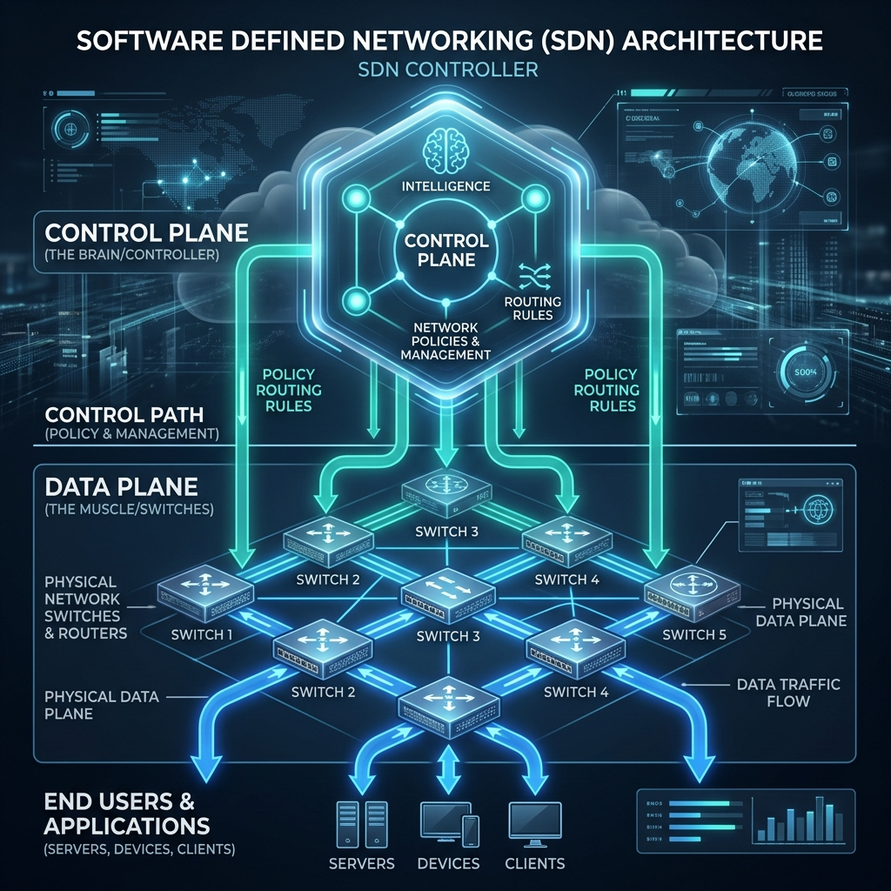

# Networking and Virtualization: A Complete Tutorial

This tutorial covers essential networking concepts, firewalls, virtual networks, VLANs, VPNs, and cloud computing fundamentals. You’ll learn through simple analogies and real‑world examples.

---

## 1. How Firewalls Work – Blocking Ports

### The Problem
You want to allow web traffic (port 80) but block file transfer traffic (port 21). How does a firewall do this?

### Analogy – The Security Guard
Imagine a building with many numbered doors:
- **Port 80** – main entrance for visitors (web traffic)
- **Port 21** – service door for file transfers

A firewall is like a security guard who checks every person trying to enter.  
The guard can say: *“Allow everyone through door 80, but block everyone at door 21.”*

### Two Types of Firewalls

| Type | Where it runs | What it can block | Example |
|------|---------------|-------------------|---------|
| **System firewall** | Inside your operating system | Port numbers, specific applications, IP addresses | Windows Defender Firewall, iptables |
| **Proxy firewall** | At the network boundary (router, gateway) | IP ranges, domain names, sometimes ports | Corporate proxy server |

> **Key insight**:  
> - System firewall = bouncer inside the club who checks your ID (port number)  
> - Proxy firewall = gatekeeper at the street who only checks your car’s license plate (IP address)

### Where is the port number stored?
In the **OSI model**:
- **IP header** (Layer 3) – contains source/destination IP addresses (like street addresses)
- **Port number** (Layer 4) – inside the TCP or UDP header, which follows the IP header

A firewall can look **beyond** the IP header into the transport header. It reads the port number without touching the actual data payload.

> **Analogy – a letter**:  
> The envelope has the address (IP header). Inside, a smaller label says “Attn: Department 80” (port number). The postal worker can open the outer envelope to read that label without reading the letter itself.

---

## 2. Internal vs. External Network Access

### Scenario
On a private corporate network, accessing an internal website (e.g., `company.intranet`) is fast. Accessing an external site (e.g., `example.com`) also works. Is there a proxy firewall?

### How it works
- **Internal website** – your DNS resolves to a private IP (e.g., 10.x.x.x or 172.x.x.x). The packet never leaves the corporate network → **no proxy firewall**.
- **External website** – your request goes through the **proxy firewall**, which gives you a public IP from a pool of addresses.

> **Analogy**:  
> Inside your home, you talk to family without stepping outside. To talk to a neighbor, you go through the front door (proxy).

---

## 3. Building Cloud Services on Top of Another Cloud

### Can you do it? Yes.
**Example: Dropbox**  
Dropbox provides cloud storage, but they don’t own their own data centers – they run entirely on AWS.

### Cautionary Tale – The Insider Attack
A small company offered business storage as a service, hosted entirely on AWS. A disgruntled ex‑employee had root credentials. They changed all recovery emails and phone numbers, then wiped every piece of data – including backups. The company was bankrupt by morning.

> **Lesson**: Even if you build on top of a reliable cloud provider, **secure your credentials** and require multiple people to authorize critical actions.

### Why build a cloud service on another cloud?
- **Licensing savings** – Some software (e.g., databases) has expensive licenses for mid‑sized teams but cheap licenses for large volumes. You can buy one large license and resell access to several smaller customers. This is a real startup idea.

### Types of cloud services you can offer on top of AWS

| Type | What you provide | Example |
|------|------------------|---------|
| **SaaS** (Software as a Service) | A complete application | Dropbox |
| **PaaS** (Platform as a Service) | A managed platform (e.g., database, runtime) | Managed database service |

> **Analogy**:  
> AWS is a large apartment building. You can rent a room (IaaS), furnish it and rent to others (PaaS), or open a restaurant inside (SaaS).

---

## 4. Virtual Networks – The Basics

### Physical vs. Virtual Components


Every physical network component has a **virtual equivalent**:

| Physical | Virtual |
|----------|---------|
| Switch | Virtual switch (software) |
| Network Interface Card (NIC) | Virtual NIC (VNIC) |
| LAN | VLAN (Virtual LAN) |
| Motherboard adapter (slot) | VM kernel adapter |

### Why does a Virtual Machine need a virtual NIC?
- A VM runs its own operating system.
- That OS has drivers that expect a **NIC** to exist.
- Without a virtual NIC, the VM cannot connect to any network – just like a physical PC without a network card.

> **Analogy**:  
> A virtual NIC is like a fake Ethernet port in a video game – the game thinks it’s real, but it’s just software.

### MAC Addresses – Can you change them?
- A physical MAC address is burned into hardware (usually unchangeable).
- However, you can **spoof** it – your software can pretend to have a different MAC address.
- Real‑world use: bypassing daily internet quotas on a shared network by changing your MAC address.

> **Key point**: A MAC address is just a 48‑bit value inside a packet. You can set it to anything – no one stops you.

---

## 5. LAN vs. VLAN – What’s the Difference?

### LAN (Local Area Network)
- A network in a single building or small area.
- Devices can communicate directly without going through a gateway.
- Can be wired or wireless.

### VLAN (Virtual LAN)
- A **logical** LAN that groups VMs even if they are on different physical machines.
- Example: VM1 and VM2 on Host A, VM3 on Host B – all in the same VLAN.

> **Analogy**:  
> - LAN = students in the same classroom.  
> - VLAN = students wearing the same color shirt, even if they are in different classrooms – they are still a “group”.

### Creating VLANs
- You need a **virtual switch** that connects the VMs.
- You can **tag** VMs with labels (e.g., “ABC” or “XYZ”) and put all VMs with the same tag into one VLAN.

### Real‑world use
Network administrators can disable LAN communication between different departments at night to prevent online gaming across buildings, while keeping LAN active within each department.

---

## 6. Network Interface Cards (NICs) – One Network at a Time

### The hardware limit
A typical laptop has **one physical NIC**. That NIC has **one interface**.  
- You can connect to **only one network at a time**.
- When you turn on Wi‑Fi, your mobile data disconnects – same reason.

### Multiple interfaces on one NIC?
You can create **virtual interfaces** (e.g., `eth0`, `wlan0`). But at any moment, an **application** uses only one interface.  
- You can configure automatic failover: if LAN fails, switch to Wi‑Fi. But not simultaneous active use.

### Expensive routers have multiple NICs
A router with 5 NICs can connect to 5 different physical networks simultaneously. That’s why high‑end routers are expensive.

> **Analogy**:  
> A single NIC is like one mouth – you can only eat from one plate at a time. Multiple NICs = multiple mouths.

---

## 7. The Virtual Networking Stack – From VM to Physical Wire

### The full chain
```
VM Operating System
    ↓
Virtual NIC (VNIC) – emulated hardware
    ↓
VM Kernel Adapter – connects VNIC to host networking
    ↓
Physical Adapter – the actual motherboard slot
    ↓
Physical NIC – real hardware
    ↓
The network (Ethernet, Wi‑Fi)
```

- **Virtual NIC**: Pretends to be real hardware for the guest OS.
- **VM Kernel Adapter**: The software bridge that links virtual to physical.
- **Physical Adapter**: The physical slot (like a RAM slot).

> **Analogy**:  
> - Virtual NIC = a toy steering wheel in a driving simulator.  
> - Kernel adapter = the software connecting the toy to the real car’s wheels.  
> - Physical adapter = the actual steering column.

---

## 8. Port Groups, NIC Teaming, and Tagging

### Port Group
- Group multiple port numbers together and attach them to **one virtual NIC**.
- Example: Ports 80 (HTTP), 443 (HTTPS), 22 (SSH) all go through VNIC1.

### NIC Teaming
- Combine multiple virtual NICs to work as a team.
- Used to create VLANs or for load balancing.

### Tagging (Labeling)
- Give a text label (e.g., “ABC”) to a VNIC.
- All VNICs with the same tag can be treated as one group – useful for VLAN creation.

> **Analogy**:  
> - Port group = putting several doors into one hallway.  
> - Tagging = giving all team members the same badge color.

---

## 9. VPN vs. VLAN – The Tunnel vs. The Group

### VPN (Virtual Private Network) – Tunneling
You have two remote offices (e.g., Hyderabad and Bangalore). Instead of laying a dedicated cable (expensive), you use the **public internet** securely.

#### How VPN tunneling works (step by step)
1. Your computer (A) creates a packet destined for a server (B).
2. The VPN client **wraps** that packet inside a **new IP packet** – the outer packet’s destination is the VPN server.
3. The outer packet travels over the public internet.
4. The VPN server removes the outer packet and forwards the inner packet to B.

> **Why wrap?**  
> The outer packet protects the inner one. On the public internet, nobody can see the original source, destination, or data.

> **Analogy – secret letter**:  
> You put a secret letter inside a plain envelope and mail it. The postman only sees the plain envelope (public IP). The recipient opens it and reads the secret letter (original IP).

### VLAN – No Tunneling
- VLAN connects VMs directly via virtual switches. No extra encapsulation.

### Is a VPN just an IP spoofer?
**No.** IP spoofing only changes the source IP address. A VPN creates a full **tunnel** with encryption and encapsulation – much more secure.

---

## 10. MTU – Maximum Transfer Unit (Packet Size Limits)

### The problem
Different network links allow different maximum packet sizes (e.g., 1500 bytes, 500 bytes).  
When you tunnel (VPN), you put one packet inside another – the total size may exceed the smallest allowed size along the path.

### The solution
The **minimum MTU** along the path determines the largest packet you can send.  
If your outer packet is 1500 bytes and the inner packet is 1400 bytes, the total is 2900 bytes – too large. You must either:
- Fragment the packet, or
- Use smaller packets.

> **Analogy – a pipe with narrow sections**:  
> The maximum flow is limited by the narrowest part of the pipe.

---

## 11. Summary Table – All Key Concepts

| Concept | Simple explanation |
|---------|--------------------|
| System firewall | Blocks ports and apps – runs on your PC |
| Proxy firewall | Blocks IPs and domain names – runs on the network |
| Port number | Stored in the transport header (TCP/UDP), not the IP header |
| Virtual NIC (VNIC) | Fake network card for a virtual machine |
| VLAN | Virtual LAN – groups VMs across physical machines |
| NIC teaming | Combines multiple virtual NICs to work together |
| Tagging | Labels VNICs to create logical groups (e.g., VLANs) |
| VPN tunnel | Encapsulates a packet inside another packet – secure over public networks |
| MTU | Maximum packet size – limited by the smallest link along the path |
| Cloud‑on‑cloud | Running your own SaaS or PaaS on top of another cloud provider (e.g., Dropbox on AWS) |

---

## Recommended Online Tutorials

- **IBM Technology**: [What is Software Defined Networking (SDN)? (YouTube)](https://www.youtube.com/watch?v=Z5ziX0oT28k)
- **Techminds**: [VLANs Explained (YouTube)](https://www.youtube.com/watch?v=0kH8Rk8vXhE)

---

## Useful Tips & Architect's Rules

- **The Broadcast Domain Rule**: A VLAN is simply a broadcast domain. If you want a packet to cross from VLAN 10 to VLAN 20, you absolutely must use a router (Layer 3), even if both VLANs exist on the exact same physical switch.
- **Zero Trust Security**: Never assume internal traffic (inside the LAN/VLAN) is safe. Implementing micro-segmentation with host-based firewalls ensures that if one VM is compromised, the attacker cannot easily move laterally to another VM on the same VLAN.
- **Underlay vs Overlay**: When working with SDN, differentiate the physical cables and switches (the Underlay) from the software-defined IP tunnels and virtual interfaces (the Overlay, like VXLAN or GENEVE). Troubleshooting usually requires checking both independently.