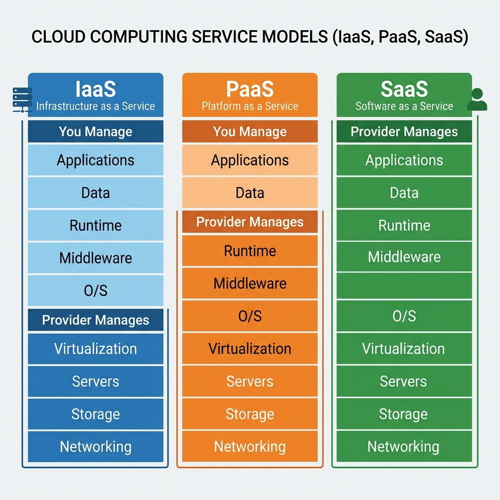

# Understanding Cloud Service Models: IaaS, PaaS, and SaaS

## From Hardware Rental to True Cloud Services

Cloud computing is often misunderstood. Many people think that simply renting a server or a laptop means they are “using the cloud.” But there is a fundamental difference between **renting infrastructure** and delivering **infrastructure as a service**.

This tutorial explains that difference, introduces the five essential characteristics of cloud computing, shows how virtualization makes cloud possible, and breaks down the three main service models: IaaS, PaaS, and SaaS.

---

## 1. Infrastructure on Rent vs. Infrastructure as a Service

### A Simple Analogy: Laptops

Imagine someone owns five laptops. They are not using all of them, so they decide to rent them out.

- **Rental mode:** They give you one laptop for a week. You use it directly. When you are done, they take it back.  
  This is **infrastructure on rent** – but it is **not** cloud computing.

- **Why not?** Because it lacks the key features that define cloud services.

Now imagine the same person installs **virtualization software** on those laptops. They create multiple **virtual machines (VMs)** on each physical laptop. Now they can give you a VM instead of the whole physical machine.  
This starts to look like **Infrastructure as a Service (IaaS)**.

> **Key insight:** Virtualization is the turning point. Without it, you only have physical rental. With it, you can deliver true cloud services.

---

## 2. The Five Essential Characteristics of Cloud Computing

A service can be called “cloud” only if it has all five of these characteristics:

| Characteristic | Meaning |
|----------------|---------|
| **On‑demand self‑service** | You provision resources yourself, without human interaction |
| **Broad network access** | Resources are available over the network (not just local) |
| **Resource pooling** | The provider’s resources are shared among multiple users |
| **Rapid elasticity** | You can scale up or down quickly, often automatically |
| **Measured service** | You pay only for what you use – usage is metered |

Simple hardware rental usually fails on resource pooling, rapid elasticity, and measured service.

---

## 3. Virtualization: The Engine of IaaS

Virtualization allows you to create **virtual machines** – software‑based emulations of physical computers.

### What does a virtual machine (VM) contain?

A physical computer has:
- Compute (CPU)
- Memory (RAM)
- Storage (hard disk)
- Network interfaces

A virtual machine has **virtual equivalents** of all these components. To the operating system and applications running inside the VM, it looks and feels exactly like a real machine.

### Why is virtualization essential for cloud?

Without virtualization, if you give physical access to a machine to multiple users:
- They can interfere with each other (one user’s heavy computation slows down others).
- You cannot enforce hard resource limits (e.g., “User A gets at most 2 GB RAM”).
- Isolation and security are weak.

With virtualization, you can:
- Partition a 16 GB physical RAM into 2 GB, 4 GB, 4 GB, and 6 GB for different VMs.
- Prevent any VM from exceeding its allocated resources.
- Dynamically create, start, stop, and delete VMs on demand.

---

## 4. Types of Virtualization (Hypervisors)

| Type | Name | Description | Efficiency |
|------|------|-------------|-------------|
| **Type 1** | Bare‑metal hypervisor | Runs directly on hardware, no underlying OS | High – used in data centers |
| **Type 2** | Hosted hypervisor | Runs on top of an existing operating system | Lower overhead, good for development |

**Examples:**  
- Type 1: VMware ESXi, Microsoft Hyper‑V, KVM (when used as bare metal)  
- Type 2: Oracle VirtualBox, VMware Workstation

For learning and local development, Type 2 hypervisors are common.

---

## 5. The Three Service Models

All cloud services fall into one of three base categories: **IaaS**, **PaaS**, or **SaaS**.



### The Building Construction Analogy

| Model | Analogy | What you manage | What provider manages |
|-------|---------|----------------|----------------------|
| **IaaS** | Empty plot with utilities (water, electricity) | OS, middleware, apps, data | Hardware, virtualization, cooling, power |
| **PaaS** | House with structure (walls, roof, floors) | Your application and data only | OS, runtime, middleware, virtualization, hardware |
| **SaaS** | Fully furnished house, ready to live in | Configuration parameters only | Everything else |

---

### Infrastructure as a Service (IaaS)

**What you get:** Virtual machines, virtual storage, virtual networks.  
**What you control:** Operating systems, databases, web servers, application code.  
**What the provider manages:** Physical hardware, hypervisor, facility (power, cooling, security).

**Examples:**  
- Creating a VM on a public cloud  
- Renting virtualized compute and storage

**Typical stack:**
```
Provider manages → Facility, Hardware, Virtualization
Consumer manages → OS, Middleware, Runtime, Data, Applications
```

---

### Platform as a Service (PaaS)

**What you get:** A platform to develop, run, and manage applications without worrying about the underlying infrastructure.  
**What you control:** Your application and its data.  
**What the provider manages:** OS, programming language runtime, web servers, database systems, and everything below.

**Key question to identify PaaS:**  
*Can you define your own database schema, create tables, set indexes, and write stored procedures?*  
If yes, you are likely using PaaS (e.g., a database service where you control the schema).

**Examples:**  
- Web hosting services where you upload your code and the provider runs it  
- A managed Kubernetes cluster (you deploy containers, but the control plane is managed)

---

### Software as a Service (SaaS)

**What you get:** A fully functional application, ready to use.  
**What you control:** Configuration settings (colors, layout, content, user preferences).  
**What the provider manages:** Everything – the application code, the runtime, the servers, the data storage.

**Examples:**  
- Email services (Gmail, Outlook.com)  
- Online office suites (Google Docs, Microsoft 365)  
- Google Sites (you build a website by dragging and dropping – no code)

> **Note on Google Sites:** You do not write any HTML or JavaScript. Google wrote the entire application. You only configure content and appearance. That is SaaS – not PaaS.

---

## 6. The Same Application – Three Different Models

Consider a simple web application (e.g., a blog or a company website).

| Model | How you would deliver it |
|-------|--------------------------|
| **IaaS** | Launch a VM, install a web server (Nginx/Apache), install a database, write your application code, configure everything manually. |
| **PaaS** | Use a web hosting service that accepts your code (e.g., Heroku, Google App Engine). You upload your application, they run it. You don’t manage the server. |
| **SaaS** | Use a site builder like Google Sites or Wix. Everything is pre‑built. You only change the text, images, and theme. |

**To the end user**, the final website might look identical. The difference is **who is responsible for what**.

---

## 7. What About Dedicated Hardware? (The “Rack” Question)

A common question: *If a company rents a dedicated rack in a data center, is that cloud computing?*

It depends.

- **Not cloud** if: You get a physical rack with raw hardware, you cannot scale on demand, you pay a fixed monthly fee regardless of usage, and the hardware is not shared (no resource pooling) – that is just **dedicated hosting**.

- **Cloud** if: Even though the rack is physically dedicated to you, the provider virtualizes the hardware, allows you to provision VMs on demand, scales resources up/down rapidly, and charges you only for what you use. The definition is about the **service model**, not about physical isolation.

> **Remember:** Cloud is defined by the five characteristics, not by where the hardware sits.

---

## 8. The Explosion of “X as a Service”

Today you will hear many terms like:

| Category | Examples |
|----------|----------|
| Compute | CPU as a Service, GPU as a Service |
| Storage | Storage as a Service, Database as a Service |
| Networking | Network as a Service, Security as a Service |
| Application | Function as a Service (FaaS), API as a Service |
| Specialized | Quantum as a Service, LLM as a Service |
| Business | Banking as a Service, Outcome as a Service |

But almost all of them fit into one of the three base models:

- **IaaS** – raw virtualized compute, storage, network  
- **PaaS** – a platform to build and deploy applications  
- **SaaS** – ready‑to‑use software

When you see a new “as a service” offering, ask: *What does the consumer manage, and what does the provider manage?* That will tell you which model it belongs to.

---

## 9. How Cloud Providers Update Services Without Downtime

A real challenge: updating software (e.g., a video conferencing app or the backend of a cloud service) without interrupting millions of users.

Common strategies:

| Strategy | How it works |
|----------|---------------|
| **Blue‑Green Deployment** | Run two identical environments (blue = current, green = updated). Switch traffic to green when ready. If problems occur, switch back to blue. |
| **Regional Rollouts** | Update one region at a time, starting with the least busy region. |
| **Scheduled Maintenance** | Notify users in advance of a planned downtime window (rare for critical services). |
| **Silent / Rolling Updates** | Update instances gradually while traffic continues; users never notice. |

These techniques allow cloud providers to maintain high availability while continuously improving their services.

---

## 10. Summary & Key Takeaways

| Concept | Takeaway |
|---------|----------|
| **Rental vs. IaaS** | Renting physical hardware is not cloud. Virtualization + five essential characteristics = IaaS. |
| **Virtualization** | Creates isolated VMs from physical hardware. Enforces resource limits and enables elasticity. |
| **IaaS** | You manage OS and above. Provider manages hardware and virtualization. |
| **PaaS** | You manage application and data. Provider manages everything else up to the runtime. |
| **SaaS** | You only configure settings. Provider manages everything. |
| **Five characteristics** | On‑demand self‑service, broad network access, resource pooling, rapid elasticity, measured service. |
| **Any XaaS** | Can be classified as IaaS, PaaS, or SaaS based on consumer vs. provider responsibility. |

---

## Recommended Online Tutorials

- **IBM Technology**: [IaaS PaaS SaaS Explained (YouTube)](https://www.youtube.com/watch?v=v2hiHnjEQRA)
- **ByteByteGo**: [Cloud Computing Service Models (YouTube)](https://www.youtube.com/watch?v=1bWoNGH_H7o)

---

## Useful Tips & Architect's Rules

- **The Serverless (FaaS) Distinction**: "Serverless" doesn't mean there are no servers; it means you don't manage them, and you scale to zero (paying nothing when idle). FaaS (Function as a Service) is an evolution of PaaS dedicated to event-driven architectures.
- **The "Lock-In" Tradeoff**: Moving up the stack to SaaS/PaaS drastically reduces your operational overhead (good), but proportionately increases vendor lock-in (bad). You can migrate an IaaS VM to another provider over the weekend. Migrating a deeply integrated PaaS database could take months.
- **Shared Responsibility Check**: If your IaaS VM gets ransomware, it is entirely your fault (you manage the OS). If a SaaS application gets ransomware, it is the vendor's fault. Know exactly where your security responsibilities start and stop.