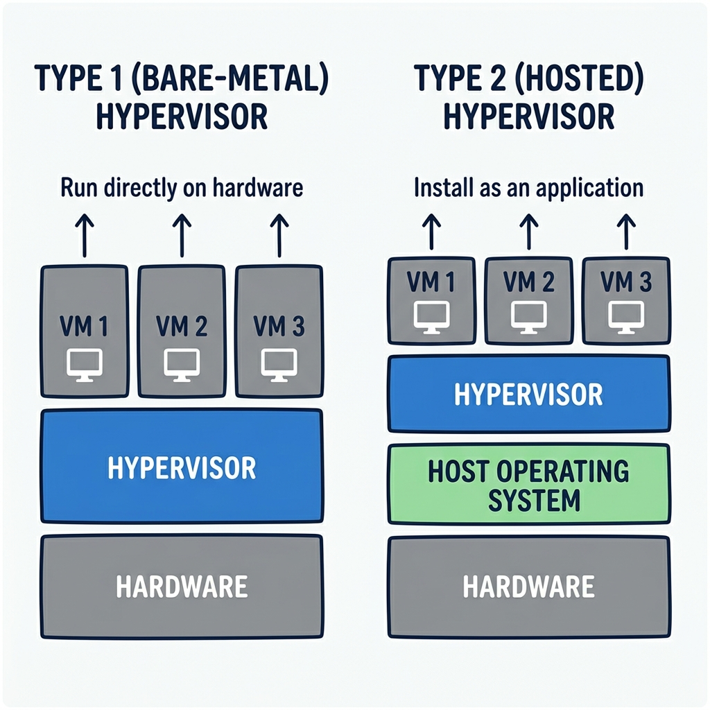

# Virtualization and Cloud Computing: A Complete Tutorial

## Introduction

Virtualization is the foundation of modern cloud computing. At its core, virtualization is about **logical separation**—taking physical resources (like a computer’s memory, processing power, and storage) and dividing them into isolated, virtual environments that behave like separate machines.

Imagine you have one large room. Virtualization is like putting up dividers to create multiple smaller rooms. Each small room:
- Has its own door (you can enter/exit independently)
- Has its own furniture (resources like RAM, CPU cores, storage)
- Can be locked or unlocked without affecting the others
- Can have different decorations (different operating systems)

From inside a small room, it feels like you have the entire house to yourself. That’s exactly what virtualization does for software.

---

## What is a Virtual Machine?

A **Virtual Machine (VM)** is a software‑based emulation of a physical computer. It runs its own operating system (called the *guest OS*) and behaves exactly like a real machine—you can start it, shut it down, reboot it, install software, and even format its virtual disk.

### Physical Machine vs. Virtual Machine

| Physical Machine | Virtual Machine |
|------------------|-----------------|
| Has all hardware directly accessible | Uses logically separated portions of hardware |
| Cannot create another physical machine inside it | Can run many VMs inside one physical host |
| Fixed hardware configuration | Flexible – resources can be changed |
| Example: your laptop or a server | Example: an Ubuntu VM running on your Windows laptop |

---

## How Resources Are Allocated to VMs

When you create a VM, you assign it a certain amount of RAM, CPU cores, and storage. How these resources are managed makes a big difference in performance and flexibility.

### 1. RAM (Memory) – Dynamic Allocation

- You allocate, say, 4 GB of RAM to a VM.
- Inside that VM, the operating system believes it has exactly 4 GB of physical memory.
- If the VM needs more than 4 GB, it will start using **swap space** (a slower area on the virtual disk) – but it cannot use more than 4 GB from the physical host.
- If multiple VMs exist, the host’s physical RAM is shared **dynamically**: a VM that needs less RAM leaves more available for others, up to each VM’s maximum allocation.

**Analogy – Piggy banks**  
You give each child a piggy bank labelled “4 GB”. Each child thinks that’s all the money they have. If a child runs out, they cannot take money from your wallet. The total money in all piggy banks cannot exceed what’s in your actual wallet (the physical RAM).

### 2. CPU Cores – Static Allocation

- CPU cores are **statically allocated**. Once you assign 4 cores to a VM, those cores are reserved exclusively for that VM.
- Other VMs cannot use those cores, even if the first VM is idle.
- Your physical machine must have enough total cores to satisfy the sum of allocations.

**Example**  
- VM1: 4 cores  
- VM2: 8 cores  
- Physical host needs at least 12 cores (plus a few for the host operating system).

**Analogy – Restaurant burners**  
A restaurant has 12 burners (physical cores). You assign 4 burners to Chef A (VM1) and 8 to Chef B (VM2). Even if Chef A uses only 2 burners, Chef B cannot use the unused ones – they are reserved.

### 3. Storage (Hard Disk) – You Can Choose

When setting up a VM, you usually have two options for the virtual disk:

| **Static Allocation** | **Dynamic Allocation** |
|-----------------------|------------------------|
| You allocate 20 GB. The full 20 GB is reserved immediately on the host. | You set a maximum of 20 GB, but the disk file starts small (e.g., 5 GB). |
| Even empty space inside the VM cannot be used by the host. | Empty space inside the VM is available to the host for other files. |
| The VM’s space is always guaranteed. | The VM may fail to expand if the host runs out of physical space. |

**Analogy – Cupboard shelves**  
- **Static**: You buy a cupboard with 20 fixed shelves. Even if you use only 5, the other 15 stay empty and nobody else can use them.  
- **Dynamic**: You have space for up to 20 shelves, but you start with 5. The empty space can be used for other things. However, if you later need 10 shelves, you must ensure the physical space is still available.

---

## What is an Operating System? (A Quick Refresher)

An **operating system (OS)** is software that manages hardware resources and lets applications run. It consists of:

- **Kernel** – the core manager (CPU scheduling, memory management, file systems, process management)
- **Device drivers** – translators between hardware and software
- **System libraries** – reusable code for common tasks

### Why operating systems have different sizes

| OS | Approximate Size | What’s Included |
|----|------------------|------------------|
| Tiny OS | ~64 KB | Only essential drivers (keyboard, mouse), basic terminal |
| Ubuntu | ~10 GB | Many drivers, graphical interface, animations, many applications |
| Windows | 20–30 GB | An even larger collection of drivers (supporting almost any hardware), extensive libraries |

**Why such a difference?**  
Windows includes drivers for nearly every possible hardware device. Ubuntu includes fewer drivers but can download them when needed. Tiny OS includes only what is absolutely necessary to run.

**Real‑world example**  
If you install Ubuntu and your Wi‑Fi stops working, it’s often because Ubuntu does not have the right driver for your Wi‑Fi card. Windows probably does (that’s one reason Windows is larger).

---

## Privilege Levels: The Ring Model

The ring model is a way to organise who can access what in a computer system. It’s a reference model – actual operating systems may implement 3, 5, or 7 rings, but the idea is the same.

```
Ring 0 (Most privileged) → Kernel, core OS, device drivers
Ring 1                  → System services
Ring 2                  → More system services
Ring 3 (Least privileged) → User applications (browser, games, etc.)
```

**What does “privilege” mean?**  
It means access to hardware resources. A program in Ring 3 cannot directly talk to hardware; it must ask the operating system (Ring 0) to do so.

**The office building analogy**  
- **Ring 0 (basement)** : Security guards, electrical room, main servers – only maintenance can enter.  
- **Rings 1‑2 (restricted floors)** : Staff‑only areas.  
- **Ring 3 (public floors)** : Anyone can enter, but they cannot access the basement.

### Where does virtualization fit?

- **OS‑level virtualization** (e.g., VirtualBox, VMware Player) – the hypervisor runs in Ring 3 or 2.  
- **Hardware‑level virtualization** (e.g., VMware ESXi, KVM) – the hypervisor runs in Ring 0 or 1.

---

## Hypervisors: The Heart of Virtualization

A **hypervisor** (also called a Virtual Machine Monitor, VMM) is the software that creates and manages virtual machines.



### Two Main Types

#### Type 2 – OS‑Level Virtualization (Hosted Hypervisor)

```
+-------------------+
|   Guest OS (VM)   |
+-------------------+
|   Hypervisor      |  (e.g., VirtualBox, VMware Player)
+-------------------+
|   Host OS         |  (Windows, macOS, Linux)
+-------------------+
|   Hardware        |
+-------------------+
```

- The hypervisor runs as an application on top of an existing operating system.
- Easy to install and use on personal computers.

#### Type 1 – Hardware‑Level Virtualization (Bare‑Metal Hypervisor)

```
+-------------------+
|   Guest OS (VM)   |
+-------------------+
|   Hypervisor      |  (e.g., VMware ESXi, KVM, Xen)
+-------------------+
|   Hardware        |
+-------------------+
```

- The hypervisor runs directly on the hardware, without a host OS.
- More efficient and secure – used in data centres and cloud providers.

**Apartment manager analogy**  
- **Type 2** : The apartment manager lives in the building and manages it part‑time.  
- **Type 1** : A dedicated management company handles everything, no one lives in their office.

---

## How Virtualization Actually Works (Two‑Step Scheduling)

When you run a program inside a VM, the request goes through two layers of scheduling:

1. **Inside the VM** – The guest OS schedules its own processes (just like on a real machine).
2. **The hypervisor** passes the combined requests to the host OS (or directly to hardware for Type 1).
3. **The host OS** (or bare‑metal hypervisor) schedules all requests from all VMs together.

### Example: Running `ls -l` inside an Ubuntu VM on a Windows host

```
1. You type "ls -l" in the Ubuntu terminal.
2. Ubuntu (guest OS) translates this command into machine instructions.
3. The hypervisor converts those instructions into something Windows understands.
4. Windows (host OS) executes them on the real hardware.
5. The result travels back through the layers to your terminal.
```

**Why this matters** – Every operation has two scheduling steps, which is why VMs are slower than running directly on the host. This overhead is the price we pay for isolation and flexibility.

---

## Types of Virtualization

| Type | Description |
|------|-------------|
| **Full Virtualization** | Complete simulation of the underlying hardware. The guest OS is unaware it is virtualized. |
| **Para‑virtualization** | The guest OS is modified to know it is virtualized and uses special instructions, improving performance. |
| **Hardware‑assisted Virtualization** | The CPU itself provides features (e.g., Intel VT‑x, AMD‑V) that make virtualization faster and simpler. |

Most modern systems use a combination of hardware‑assisted and para‑virtualization techniques.

---

## From Virtualization to the Cloud: Building Services, Not Just Applications

In the cloud computing world, there is an important distinction:

- **Cloud application** – You use cloud resources to run your software (e.g., a photo gallery hosted on AWS).
- **Cloud service (as a service)** – You provide a platform that other people can build upon. Your offering is dynamically scalable, self‑service, and multi‑tenant.

### Examples to Clarify

| Cloud Application | Cloud Service (as a service) |
|------------------|-------------------------------|
| A calculator website that runs on a cloud VM | A customizable calculator platform where businesses can create their own branded calculators |
| Gmail as an email client | Gmail allowing universities to have custom email domains (e.g., @myuniversity.edu) – that’s email as a service |
| A shopping cart on a cloud server | An e‑commerce platform that lets any merchant build their own online store |

**Key characteristics of a true “as a service” offering**  
- Dynamically scalable – resources grow and shrink with demand.  
- Tailored to the user – configuration, branding, or features can be customised.  
- Self‑service – users can provision what they need without contacting you.  
- Multi‑tenant – many users share the same underlying infrastructure securely.

When you design a cloud project, aim to be a **service provider**, not just a service user. That’s where the real value of cloud computing lies.

---

## Practical Tips for Learning Virtualisation

1. **Install a hypervisor on your own machine**  
   Download VirtualBox or VMware Workstation Player (both are free). Create a VM, install a lightweight Linux distribution (e.g., Ubuntu Server), and experiment with resource allocations.

2. **Test static vs. dynamic storage**  
   Create two VMs – one with a static disk, one with a dynamic disk. Copy large files inside each and watch how the host’s disk space changes.

3. **Observe the ring model in action**  
   Try to access a hardware device (e.g., your webcam) directly from a simple program in Ring 3. You’ll see it’s impossible without going through the OS.

4. **Use a cloud simulator**  
   Before spending money on real cloud providers, use tools like **CloudSim** to simulate VM allocation, load balancing, and migration. It’s a safe way to test ideas.

5. **Graduate to real clouds**  
   Once you have a working simulation, try implementing a small part on a real cloud using free credits (many providers offer starter credits). Compare the simulation results with real performance.

---

## Summary of Key Concepts

| Concept | One‑Sentence Takeaway |
|---------|----------------------|
| **Virtualization** | Logical separation of physical resources into isolated, virtual environments. |
| **Virtual Machine** | A software‑based computer that runs its own OS and behaves like real hardware. |
| **RAM allocation** | Dynamic – VMs share physical RAM up to their allocated maximum. |
| **CPU allocation** | Static – cores are reserved exclusively for each VM. |
| **Storage allocation** | Static (space reserved upfront) or dynamic (grows on demand). |
| **Operating System** | Manages hardware, includes kernel + drivers + libraries. |
| **Ring model** | Privilege levels from 0 (most) to 3 (least). |
| **Hypervisor** | Software that creates and manages VMs. |
| **Type 1 hypervisor** | Runs directly on hardware (bare‑metal). |
| **Type 2 hypervisor** | Runs on top of a host OS. |
| **Cloud application** | Uses cloud resources. |
| **Cloud service** | Provides a scalable, multi‑tenant platform for others to use. |

---

## Final Thoughts

Virtualization is not just a technical trick – it is the engine behind modern cloud computing. By understanding how resources are partitioned, how hypervisors work, and the difference between an application and a service, you are building the mental model needed to design and operate cloud infrastructure.

---

## Recommended Online Tutorials

- **IBM Technology**: [Hypervisors Explained (YouTube)](https://www.youtube.com/watch?v=F_fERX7vQjE)
- **TechTarget**: [What is Virtualization? (YouTube)](https://www.youtube.com/watch?v=f2V5A1qF88w)

---

## Useful Tips & Architect's Rules

- **Ring 0 / Root Privilege**: Modern CPUs have introduced Ring -1 (Root operation) specifically for Type 1 hypervisors, allowing the Guest OS to run safely in Ring 0 without crashing the host bare-metal hardware.
- **Noisy Neighbors**: Even with strong VMs, underlying physical I/O (like disk arrays or network cards) can be bottlenecked if another tenant pushes the hardware to its absolute limits. Hardware-assisted virtualization mitigates CPU/RAM noise, but I/O queues are harder to partition cleanly.