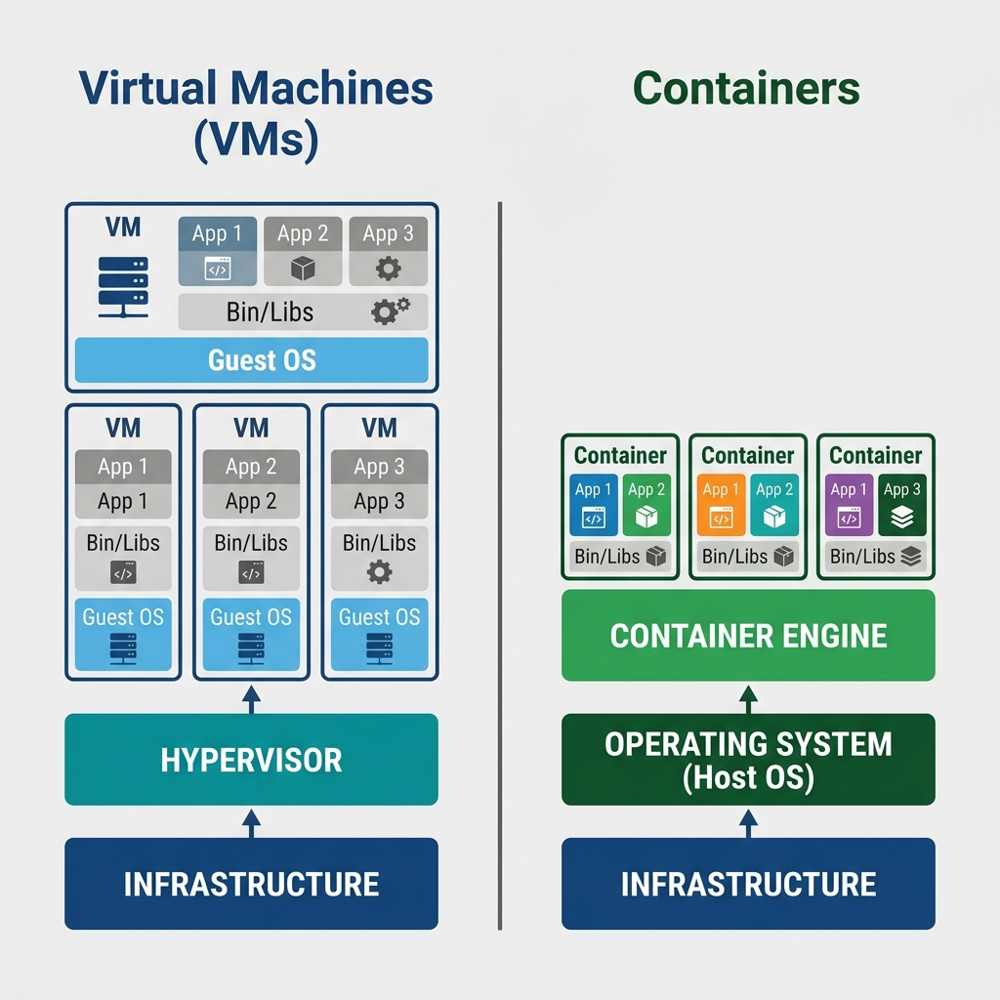
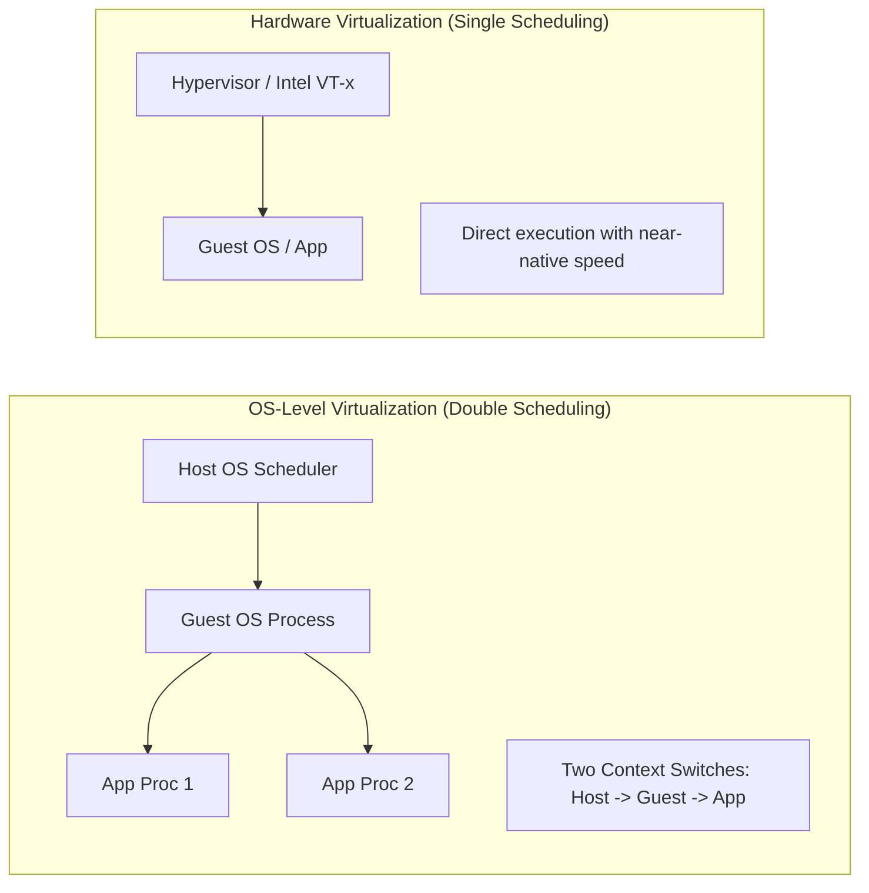

# Virtualization Deep Dive: OS‑Level vs. Hardware‑Level Virtualization

A self‑contained tutorial for understanding the performance differences, resource allocation, and live migration in virtualized environments.

---

## 1. The Big Question

When you create multiple virtual machines on a single physical computer, you have two main approaches:



- **OS‑level virtualization** (e.g., Docker containers, LXC) – all guests share the same operating system kernel.
- **Hardware‑level virtualization** (e.g., VirtualBox, VMware, KVM) – each guest runs its own full operating system, and a hypervisor manages the hardware.

Which one delivers better performance, and why?  
**Answer:** Hardware virtualization is more performance‑efficient. Let’s find out why.

---

## 2. The Kernel Sharing Myth

Many people first think: “In OS‑level virtualization, all guests share the same kernel, so the kernel becomes a bottleneck.” That sounds logical, but let’s test it.

If your physical machine has 8 GB RAM, an i7 processor, and a modern operating system, the OS can easily handle that hardware. A true kernel bottleneck would mean the OS is **not suitable** for the hardware – like trying to run an old OS on a much larger machine.

### A Real Example: Windows XP and File Size Limits

Windows XP on a 16 GB RAM machine still cannot open a 6 GB file. Why? Not because of the kernel – because of the **file system**. Windows XP used FAT32 by default, which has a **4 GB maximum file size**. The problem was the file system’s addressing scheme, not the kernel sharing.

**Takeaway:** The kernel‑bottleneck argument does not fully explain the performance difference. We must look deeper.

---

## 3. The Real Reason: Layers and System Call Translation

The key difference lies in how many software layers stand between your application and the hardware – and what those layers do.

### Hardware Virtualization (faster)

```
Application → Guest OS → Hypervisor → Hardware
```

### OS‑Level Virtualization (slower)

```
Application → Guest OS → Virtualization Layer → Host OS → Hardware
```

The extra **virtualization layer** in OS‑level virtualization adds significant overhead. Let’s see why.

### System Call Translation

Imagine you run a Linux virtual machine on a Windows host (using OS‑level virtualization).  
- Your application makes **Linux system calls**.  
- The guest OS (Linux) handles them.  
- The virtualization layer must **translate** each Linux system call into an equivalent Windows system call.  
- The Windows host OS then executes that call on the hardware.

Translation is like speaking through an interpreter – every conversation takes longer and can lose precision.

In hardware virtualization, the hypervisor is **bare‑minimum**. It does not do full system call translation; it simply allocates resources and lets the guest OS talk directly to the hardware (with hardware support like Intel VT‑x or AMD‑V). The overhead is much smaller.

---

## 4. Double Scheduling – The Hidden Performance Killer

This is the most important concept. Let’s walk through a concrete scenario.

Suppose you have a VM (guest) running three processes: **P1, P2, P3**.  
The physical machine also runs two other host processes: **H1, H2**.

### In OS‑Level Virtualization

- The **host OS** sees the whole VM as **one process** (let’s call it G1).  
- The host OS scheduler’s queue looks like:  
  `[P1, P2, P3, H1, H2]` – *all processes appear together*.  
- When it is G1’s turn (the VM), the guest OS’s own scheduler runs **P1, P2, P3** in its own queue.

**Result:** Context switching happens **twice**:
1. Inside the guest OS – switching between P1, P2, P3.  
2. Outside in the host OS – switching between G1, H1, H2.

Every context switch involves saving and restoring Program Control Blocks (PCBs), register values, and memory maps. Doing it twice for the same application creates visible slowdown.



### In Hardware Virtualization

- The hypervisor does **not** act as a full scheduler.  
- Each guest OS manages its own processes independently.  
- The hypervisor only allocates physical CPU cores to virtual CPUs and stays out of the way.

No double scheduling → much lower overhead.

**Analogy:**  
- **Hardware virtualization** – Each team has its own manager, and the senior manager only assigns meeting rooms.  
- **OS‑level virtualization** – The senior manager also micro‑manages every team’s internal task switching. Chaos and delays.

---

## 5. Libraries and Dynamic Linking

Operating systems use libraries (DLLs on Windows, shared objects on Linux). How those libraries are loaded affects performance and flexibility.

### Types of Loading

| Loading Type     | When it happens                      | Example                                        |
|------------------|--------------------------------------|------------------------------------------------|
| **Compile‑time** | Before the program is compiled       | Page size (usually 4 KB)                      |
| **Boot‑time**    | When the OS starts                   | Device drivers in older Windows (XP)          |
| **Config‑time**  | During installation / first run      | App permissions on a smartphone               |
| **Runtime**      | Any time while the program executes  | Plug‑and‑play for a new USB device on Windows 11 |

### Why Did Old Windows Need a Restart for a New Mouse?

Windows XP loaded device drivers at **boot‑time**. When you plugged in a new device, the driver was not loaded until you restarted the system.  
Modern operating systems (Windows 10/11, Linux) load drivers at **runtime** – no restart needed.

### Relevance to Virtualization

In OS‑level virtualization, both the guest OS and the host OS have their own sets of libraries. System calls from the guest may need to be translated into library calls for the host, adding even more overhead. In hardware virtualization, the hypervisor does not carry a full set of libraries, so this extra translation is avoided.

---

## 6. Resource Allocation: RAM and Hard Disk

### RAM – Always Dynamic

**Why is RAM always dynamically allocated?**  
RAM is an expensive, critical resource. Static allocation would waste it.

**Example:**  
- Physical RAM: 8 GB  
- Host OS needs: ~1–2 GB  
- Remaining for VMs: 6–7 GB  
- You can run **only one** 4 GB VM simultaneously.  
- Trying to run two 4 GB VMs would overcommit the memory – the hypervisor will refuse or crash.

**Analogy:** A classroom that costs a lot per hour.  
- Static allocation = book the room 24/7 even if you use it only 2 hours. Waste.  
- Dynamic allocation = book only when needed. Efficient.

### Hard Disk – Can Be Static or Dynamic

Hard disks are much cheaper than RAM. That is why virtualization platforms give you a choice.

**Static allocation** – You reserve, say, 20 GB for a VM at creation time. The host OS sees a 20 GB file immediately, even if the guest OS only uses 5 GB.  
**Dynamic allocation** – The VM’s disk file starts small and grows only as the guest actually writes data.

**Example with 10 GB total disk:**  
- Host OS uses 2 GB → 8 GB free.  
- Create 4 VMs, each statically allocated 2 GB → host sees 0 GB free (but actual usage might be only 4 GB).  
- With dynamic allocation, the host sees ~4 GB free (because each lightweight OS uses only ~1 GB). You can now install more applications without reconfiguring.

---

## 7. Live Migration – The Ultimate Challenge

**Live migration** means moving a running virtual machine from one physical server to another (or changing its resources) **without shutting it down**. This is crucial for cloud elasticity (“scale up/down on demand”).

### Two Types of Live Migration

1. **VM to another physical machine** – transfer the entire VM while it runs.  
2. **Change VM configuration at runtime** – add or remove RAM, CPU cores, etc., on the same or different host.

### Why Is This So Hard?

RAM and CPU allocation are **boot‑time parameters** in most operating systems. When you change them, the **addressing scheme** changes.

**Analogy:** Imagine you expand a building while people are living in it.  
- Every apartment number (memory address) would change.  
- Everyone’s mail, delivery instructions, and internal maps would break.

In a computer:  
- The Translation Lookaside Buffer (TLB) and page tables must be updated.  
- All running processes’ Program Control Blocks (PCBs) need new memory references.  
- The OS must support this without crashing.

### How Some Vendors Do It

They use techniques similar to **P2P vs. client‑server** architectures:  
- **Client‑server** (traditional migration): A central coordinator moves the VM step by step – slow and risky.  
- **P2P** (advanced live migration): The source and destination hypervisors directly negotiate, pre‑copy memory pages while the VM still runs, then switch over in a very short pause (milliseconds).  
*This is analogous to how modern messaging apps send media directly between devices instead of through a central server.*

---

## 8. Putting It All Together – Comparison Table

| Feature                     | OS‑Level Virtualization                     | Hardware‑Level Virtualization               |
|-----------------------------|----------------------------------------------|----------------------------------------------|
| **Kernel**                  | Shared across guests                         | Each guest has its own kernel                |
| **System calls**            | Translated from guest → host                 | Direct execution (with hardware assist)      |
| **Scheduling**              | Double (guest + host)                        | Single (guest only)                          |
| **Libraries (DLLs)**        | Two sets (guest + host)                      | Only guest libraries; hypervisor is minimal  |
| **Performance**             | Slower (visible overhead)                    | Near‑native performance                      |
| **RAM allocation**          | Always dynamic                               | Always dynamic                               |
| **Disk allocation**         | Static or dynamic (configurable)             | Static or dynamic (configurable)             |
| **Use case**                | Lightweight, same OS family (e.g., all Linux)| Full isolation, different OS types           |

---

## 9. Key Takeaways for Practitioners

1. **Prefer hardware virtualization** when performance and isolation are critical (e.g., cloud servers, running multiple OS types).  
2. **OS‑level virtualization (containers)** is great for fast startup and density when you trust the shared kernel (e.g., microservices on the same Linux distribution).  
3. **RAM is expensive** – never overcommit it unless your hypervisor explicitly supports swapping (which kills performance).  
4. **Dynamic disk allocation** saves space but may fragment; static allocation gives predictable performance.  
5. **Live migration** is not magic – it requires careful design. Many cloud platforms still need a short VM pause during migration.  
6. Understanding **loading types** (compile, boot, config, runtime) helps you debug why some changes require a restart and others do not.

---

## 10. Suggested Hands‑On Exercises

- Create a VM with **static** disk allocation and another with **dynamic**. Compare the host’s file sizes before and after installing software inside the VM.  
- Run a CPU‑intensive task inside an OS‑level container and inside a hardware VM. Use `perf` or Task Manager to measure context switch rates.  
- Check your operating system’s page size: on Linux, `getconf PAGE_SIZE`; on Windows, `wmic os get osarchitecture` (usually 4 KB).  
- Research how Kubernetes manages GPU resources – it uses scheduling policies similar to the “double scheduling” concept but for containers.

---

## Recommended Online Tutorials

- **IBM Technology**: [Virtual Machines vs Containers (YouTube)](https://www.youtube.com/watch?v=cjXI-yxqGTI)
- **TechWorld with Nana**: [Docker Tutorial for Beginners (YouTube)](https://www.youtube.com/watch?v=3c-iBn73dDE)

---

## Useful Tips & Architect's Rules

- **The Density Argument**: You can fit roughly 10x-100x more containers on the same physical hardware compared to VMs because containers don't boot an entire Guest OS. This translates perfectly to Cloud Costs: denser workloads = lower OPEX bills.
- **Kernel Panics Drop Everything**: In a container environment, if one container manages to panic (crash) the shared Host Linux Kernel, *every* container on that host goes down. In a VM environment, a Guest kernel crash only affects that specific VM.
- **Nested Virtualization**: You can run containers *inside* VMs (e.g., running Docker inside AWS EC2). This gives you the density advantages of containers combined with the physical isolation advantages of hardware virtualization.