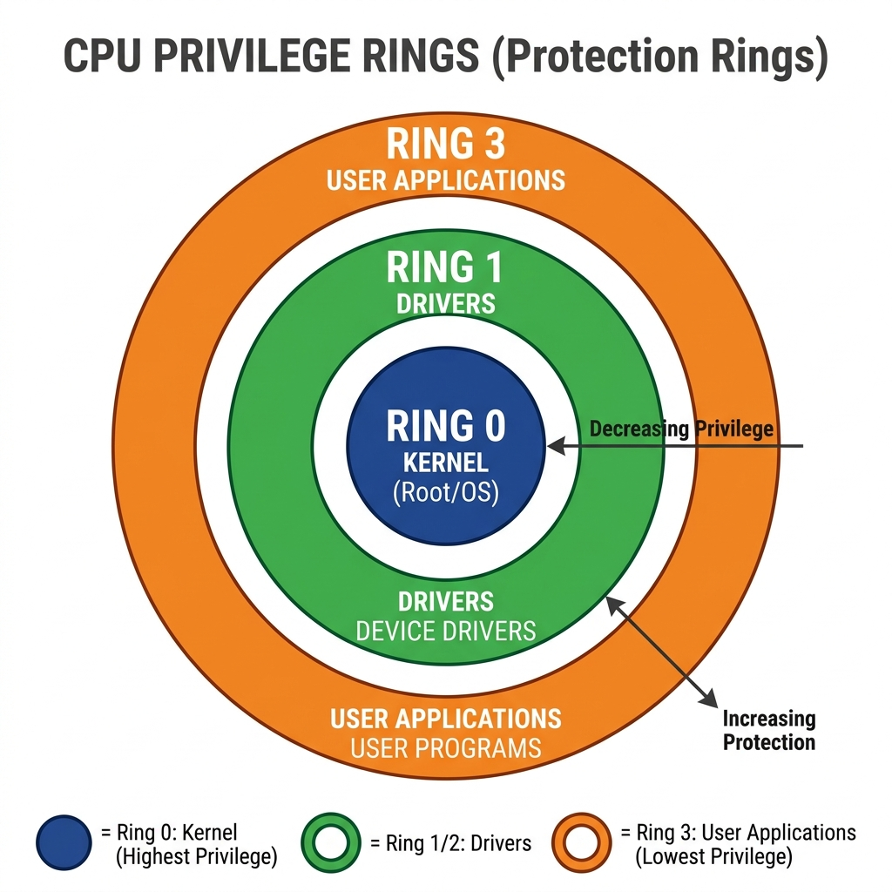
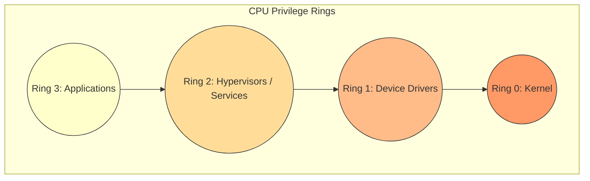

# Understanding Virtualization and Operating System Privilege Rings

A comprehensive tutorial on how virtualization works, the role of privilege rings, and what really happens when you delete a file.

---

## Table of Contents

1. [Two Main Types of Virtualization](#two-main-types-of-virtualization)
2. [Three Flavors of Hardware Virtualization](#three-flavors-of-hardware-virtualization)
3. [Why Hypervisors Are “Special” Processes](#why-hypervisors-are-special-processes)
4. [Privilege Rings: Ring 0 to Ring 3](#privilege-rings-ring-0-to-ring-3)
5. [POST: The Power‑On Self Test](#post-the-power-on-self-test)
6. [File Deletion and Recovery – What Really Happens](#file-deletion-and-recovery--what-really-happens)
7. [Hardware Access vs. Hardware Control](#hardware-access-vs-hardware-control)
8. [Key Takeaways](#key-takeaways)

---

## Two Main Types of Virtualization

Virtualization comes in two primary forms: **OS‑level virtualization** and **hardware virtualization**.

### OS‑Level Virtualization

Think of this as **roommates sharing one apartment**. Everyone has their own bedroom, but they share the kitchen, bathroom, and living room.

- **Examples:** Docker containers, Linux containers (LXC)
- **What happens:** A single host operating system runs multiple isolated user‑space instances (containers). They all use the same OS kernel.
- **Efficiency:** Very low overhead – containers start in milliseconds.
- **Isolation:** Less strict; containers share the host kernel.

```
┌─────────────────────────────────────────┐
│           Physical Hardware             │
├─────────────────────────────────────────┤
│        Host Operating System            │
├─────────────────────────────────────────┤
│  ┌──────┐ ┌──────┐ ┌──────┐            │
│  │ App1 │ │ App2 │ │ App3 │  (containers)│
│  └──────┘ └──────┘ └──────┘            │
└─────────────────────────────────────────┘
```

### Hardware Virtualization

Think of this as a **duplex or apartment building**. Each apartment has its own kitchen, bathroom, and living room. Neighbors may not even know each other exists.

- **Examples:** VirtualBox, VMware, KVM
- **What happens:** A hypervisor (or host OS with hypervisor) creates fully separate virtual machines (VMs). Each VM runs its own complete guest OS.
- **Efficiency:** Higher overhead – each VM includes a full OS.
- **Isolation:** Very strong – VMs are completely separated by hardware emulation.

```
┌─────────────────────────────────────────┐
│           Physical Hardware             │
├─────────────────────────────────────────┤
│     Bare‑Minimum OS + Hypervisor        │
├─────────────────────────────────────────┤
│  ┌─────────────┐  ┌─────────────┐       │
│  │  Guest OS 1 │  │  Guest OS 2 │       │
│  │  ┌───────┐  │  │  ┌───────┐  │       │
│  │  │ Apps  │  │  │  │ Apps  │  │       │
│  │  └───────┘  │  │  └───────┘  │       │
│  └─────────────┘  └─────────────┘       │
└─────────────────────────────────────────┘
```

> **Note:** In OS‑level virtualization, each virtual machine is actually a **special process** on the host operating system. This is why you can create a VM and give it 2 GB of RAM even when your host OS typically limits regular applications to 1 GB – the hypervisor runs with higher privileges.

---

## Three Flavors of Hardware Virtualization

Hardware virtualization itself comes in three main varieties.

### 1. Full Virtualization

- **What it does:** Completely simulates **all** hardware components – CPU, memory bus, storage, network card, etc.
- **How it works:** A virtual machine monitor (VMM) translates every guest instruction on the fly.
- **Example:** Running an unmodified Windows OS inside VirtualBox on a Linux host.

**Simple analogy:** A flight simulator. It has a fake cockpit, fake controls, fake screens – everything is simulated, but the pilot feels like they are flying a real plane.

### 2. Para‑Virtualization

- **What it does:** Does **not** fully simulate hardware. Instead, it provides an isolated environment by dividing real hardware resources.
- **How it works:** Uses **time division multiplexing** (TDM) or **space division multiplexing**. The guest OS is modified to know it is virtualized and makes hypercalls.
- **Memory bus is not virtualized** – hardware is simply shared in a controlled way.

**Simple analogy:** A shared laundry room in an apartment building. You use the washing machine from 2–3 PM, your neighbor uses it from 3–4 PM (time division). No one needs a “virtual washing machine” – they just follow a schedule.

### 3. Hardware‑Assisted Virtualization

- **What it does:** The physical hardware (CPU) has built‑in support for virtualization instructions (e.g., Intel VT‑x, AMD‑V).
- **Requirement:** Often you need to enable “hardware acceleration” in the BIOS/UEFI.
- **Why it matters:** Traditional x86/x64 architectures were not designed for virtualization. Hardware extensions add new privilege levels and instructions specifically for virtual machine management.

**Simple analogy:** A car with 4‑wheel drive vs. a regular car. The 4WD vehicle has special hardware built‑in to handle off‑road conditions. Similarly, CPUs with virtualization extensions have special circuits to handle VMs efficiently.

---

## Why Hypervisors Are “Special” Processes

You might wonder: *If my web browser, media player, and text editor all run as normal processes, why can a hypervisor (like VirtualBox) do special things – like allocate 2 GB of RAM when the OS normally caps applications at 1 GB?*

The answer lies in **privilege rings**. The operating system does not treat all processes equally. Some run with higher privilege than others.

---

## Privilege Rings: Ring 0 to Ring 3

Modern CPUs support a **ring‑based privilege model** – a reference architecture that most operating systems follow in some form (though actual implementations vary).





### What Can Each Ring Do?

| Privilege Level | Who Lives Here | What They Can Do |
|----------------|----------------|------------------|
| **Ring 0** | Kernel, core OS | Direct hardware control, memory management, CPU power control, handle hardware interrupts |
| **Ring 1** | Device drivers | Talk directly to hardware devices (disk, network, graphics) |
| **Ring 2** | Hypervisors, some system services | Manage virtual machines, allocate dedicated resources, negotiate with kernel |
| **Ring 3** | Regular apps (browser, editor, media player) | Only ask the OS for resources – cannot touch hardware directly |

### Simple Analogy

- **Ring 0** = Building maintenance crew. They have keys to every apartment, can turn off the main water supply, access the electrical panel.
- **Ring 1** = Elevator technicians. They can work on elevator motors and control panels.
- **Ring 2** = Security guards. They can override locks, view camera feeds, but not rewire the building.
- **Ring 3** = Regular tenants. They can only use their own apartment. If something breaks, they must file a request.

### Where Does the Hypervisor Run?

A hypervisor (like VirtualBox or KVM) typically runs in **Ring 1 or Ring 2**. This gives it:
- The ability to **negotiate** for more memory than a normal app.
- Permission to **allocate dedicated CPU cores** to a VM.
- Access to special system calls that regular applications cannot use.

That is why you can configure a VM to use 2 GB of RAM even when your web browser is capped at 1 GB – the hypervisor has elevated privileges.

> **Tricky point:** The **operating system as a whole** is not confined to one ring. Parts of the OS run in Ring 0 (kernel), other parts in Ring 1 (drivers), and still other parts (like system services) may run in Ring 2 or 3. The kernel is in Ring 0, but the OS spans multiple rings.

---

## POST: The Power‑On Self Test

Before any operating system loads, the computer runs a **Power‑On Self Test (POST)**. This lives in what we might call **Ring -1** – outside the OS entirely.

### What POST Checks

- CPU fan operation
- Memory module presence
- Basic storage connectivity
- Other essential hardware components

### How You Know Something Is Wrong

If a component fails POST, the computer emits **beep codes**. Different patterns mean different problems:

| Beep Pattern | Likely Problem |
|--------------|----------------|
| 1 short beep + screen flash, then power off | CPU fan failure |
| 3 short beeps | Memory not detected |
| Continuous beeping | Power supply issue |

**Simple analogy:** POST is like a pilot’s pre‑flight checklist. Before takeoff, the pilot checks: “Engines? Flaps? Fuel?” If any check fails, the plane does not leave the ground.

---

## File Deletion and Recovery – What Really Happens

When you delete a file, most people think the data is erased. In reality, **deleting is not erasing**.

### The Book Index Analogy

Imagine your hard disk is a **book**:
- **Pages** = storage blocks (sectors)
- **Index at the front** = file system table (like a table of contents)

```
┌─────────────────────────────────────────┐
│  INDEX (File System Table)             │
│  - "report.pdf" → Pages 10–25          │
│  - "photo.jpg"  → Pages 26–30          │
│  - "movie.mp4"  → Pages 31–58          │
├─────────────────────────────────────────┤
│  Page 10–25: [PDF data]                │
│  Page 26–30: [JPEG image data]         │
│  Page 31–58: [video data]              │
└─────────────────────────────────────────┘
```

### What “Delete” Actually Does

When you delete a file, the operating system **removes only the index entry**. The actual data pages remain untouched until they are overwritten.

```
BEFORE DELETE:
Index says: "photo.jpg" → Pages 26–30

AFTER DELETE:
Index entry for "photo.jpg" is gone.
BUT Pages 26–30 still contain the image data!
```

### Fast Format vs. Full Format

| Format Type | What It Does | Speed | Security |
|-------------|--------------|-------|----------|
| **Fast format** | Removes index only | Seconds | Low – data recoverable |
| **Full format** | Overwrites every page (writes zeros or random data) | Minutes to hours | High – data gone |

### How File Recovery Software Works

Recovery tools scan the disk **bit by byte**, looking for:
1. **Start‑of‑file markers** (specific byte patterns)
2. **End‑of‑file markers**
3. **File type metadata** (to guess the file format)

**The challenge:** Different file types use different markers.

| File Type | Typical Start Marker | End Marker |
|-----------|---------------------|-------------|
| PDF | `%PDF` | `%%EOF` |
| JPEG | `FF D8` | `FF D9` |
| PNG | `PNG` signature | `IEND` chunk |

A recovery tool must try many possible interpretations: is this 2‑byte marker the start of a JPEG, or part of a larger structure? This makes perfect recovery difficult.

### Why You Should Stop Using a Computer Immediately After Accidental Deletion

Every action you take **risks overwriting** the deleted data:

| Action | Risk |
|--------|------|
| Browsing the web | Cache files written to disk |
| Shutting down | System logs written |
| Installing software | New files may land in the “free” space |
| Plugging in a USB drive | Driver files installed on disk |

**Simple analogy:** Imagine you dropped your car keys in a huge pile of sand. Every time you walk through the sand, you disturb it and make it harder to find the keys. The best strategy is to stop walking and carefully search. Similarly, stop using your computer and use a dedicated recovery tool from a bootable USB.

### Does a Full Hard Disk Weigh More Than an Empty One?

This is a fascinating question. The answer is **theoretically yes, but the difference is incredibly tiny**.

- On a **magnetic hard disk**, data is stored by aligning magnetic dipoles. Aligned dipoles have different energy states than random dipoles. Different energy means different mass‑energy equivalence (\(E=mc^2\)).
- On an **SSD**, electrons are trapped in floating gates. A “full” disk has more electrons in specific states than an “empty” disk? Not exactly – because an “empty” disk is not truly empty; it contains random 0s and 1s. Both states have the same number of bits. The difference is **order** (entropy), not raw electron count.

**Simple analogy:** People standing on a boat. If they stand randomly, the boat is stable. If they all rush to one side, the boat tilts. The total weight of people is the same, but the distribution changes the boat’s behavior. Similarly, the arrangement of magnetic domains can produce minute weight differences – but they are far too small for any ordinary scale to detect.

---

## Hardware Access vs. Hardware Control

A critical distinction in operating systems: **accessing** hardware is not the same as **controlling** hardware.

### The Camera Example

| **Hardware Access** (Ring 3) | **Hardware Control** (Ring 0/1) |
|------------------------------|--------------------------------|
| Video conferencing app (e.g., Zoom, Meet) | Camera device driver |
| Receives video feed from the OS | Directly manages camera registers |
| Can request higher resolution | Can power the camera on/off |
| Cannot bypass OS permission checks | Can access any memory address |

**What a user‑app can do:**
- Request camera permission
- Receive video frames
- Adjust brightness/contrast (through OS system calls)

**What a user‑app cannot do:**
- Directly write to camera hardware registers
- Turn the camera on without the OS knowing
- Access camera memory directly

### Simple Analogy

- **Hardware access** = You are watching TV. You can change channels, adjust volume, turn it on/off with the remote. You cannot open the back panel and touch the circuits.
- **Hardware control** = You are a TV repair technician. You can open the casing, replace capacitors, solder connections, test voltages.

The operating system acts as the gatekeeper, ensuring that user applications only get **access** while **control** remains with privileged kernel‑mode drivers.

---

## Key Takeaways

1. **Two main virtualization types** – OS‑level (containers) and hardware virtualization (VMs). Choose based on your need for isolation vs. efficiency.

2. **Three flavors of hardware virtualization** – Full, para, and hardware‑assisted. Hardware‑assisted uses CPU extensions for better performance.

3. **Privilege rings** – Not all processes are equal. Hypervisors run in Ring 1 or 2, giving them special abilities that regular apps (Ring 3) do not have.

4. **POST (Power‑On Self Test)** – Runs before the OS, in “Ring ‑1”. It checks essential hardware and uses beep codes to report failures.

5. **Deleting is not erasing** – When you delete a file, only the index entry is removed. The actual data remains until overwritten. Recovery is possible if you act quickly and avoid using the disk.

6. **Fast vs. full format** – Fast format removes the index; full format overwrites data. For security, always use full format when disposing of a drive.

7. **Access ≠ Control** – User applications access hardware through the OS. Only kernel‑mode drivers control hardware directly.

8. **Cloud is not magic** – Moving a legacy application to a cloud VM does not automatically make it scalable. The application must be architected to use cloud features like auto‑scaling, load balancing, and distributed storage.

---

## Recommended Online Tutorials

- **PowerCert Animated Videos**: [CPU Rings Explained (YouTube)](https://www.youtube.com/watch?v=1bWoNGH_H7o)
- **Computerphile**: [Protection Rings (YouTube)](https://www.youtube.com/watch?v=2nptEQDUSwQ)

---

## Useful Tips & Architect's Rules

- **The Ring -1 Rule**: Intel VT-x and AMD-V effectively created "Ring -1" (VMX Root Mode) so the hypervisor could have more privilege than a Guest OS's Ring 0 Kernel. If a Guest OS thinks it holds Ring 0, the CPU intercepts critical hardware calls and passes them to Ring -1 silently.
- **Syscall Overhead**: Jumping from Ring 3 (User Land) to Ring 0 (Kernel Land) is an expensive CPU context switch called a "syscall". High-performance networking apps (like DPDK) bypass the Kernel completely, staying in Ring 3 but mapped directly to the NIC hardware to avoid this penalty.