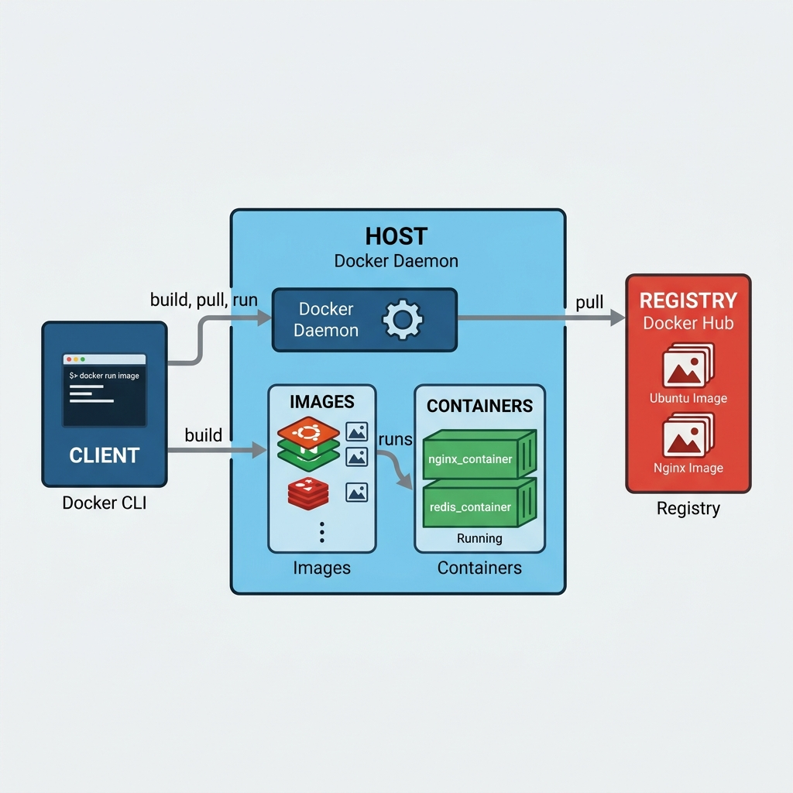

# Virtualization and Containerization: A Complete Technical Guide

This tutorial explains how modern software runs on servers and in the cloud. You will learn about privilege rings, hypervisors, virtual machines (VMs), containers, and how to choose between them.

---

## 1. Privilege Rings: The Foundation of Hardware Control

Modern CPUs use a concept called **protection rings** to manage which software can access hardware resources. Rings are numbered from 0 (most privileged) to 3 (least privileged).

### The Ring Model

- **Ring 0 (Kernel Mode)** – The most privileged level. Software running here has direct, unrestricted access to hardware (CPU, memory, devices).
- **Ring 1 and 2** – Intermediate privilege levels. Rarely used by mainstream operating systems.
- **Ring 3 (User Mode)** – Least privileged. Applications run here and must ask the operating system to perform hardware operations via system calls.

### Why Rings Matter for Virtualization

A **hypervisor** (also called Virtual Machine Manager or VMM) must run at Ring 0. Why? Because controlling hardware is different from merely accessing it.

- **Access** means using hardware resources for your own tasks.
- **Control** means deciding who gets which resources, isolating one program from another, and enforcing limits.

A hypervisor needs control to:
- Create separation between virtual machines
- Allocate dedicated resources to each VM
- Reserve hardware for specific workloads

### Example: The Xen Hypervisor

Xen is a virtualization platform that places its hypervisor at Ring 0. In its reference architecture:
- **Ring 0** – Virtual Machine Manager (hardware control)
- **Ring 1** – VM management and guest operating systems
- **Ring 3** – User applications

A guest operating system has its own system calls. The hypervisor maps these to physical hardware operations. Different hypervisors may use rings differently, but the principle remains: the hypervisor occupies the highest privilege level.

---

## 2. Three Approaches to Virtualization

Not all virtualization works the same way. The diagrams below explain three common methods.

### 2.1 Full Virtualization

In full virtualization, the hypervisor (running in Ring 0) presents a complete virtual hardware set to each guest operating system. The guest OS believes it is running on real hardware and does not need modification.

**How it works:**
- Guest OS → VMM → System hardware
- User applications → Normal OS path → Hardware

The VMM emulates all hardware components: CPU, memory, disk, network interfaces. Every guest OS instruction is trapped and translated.

**Pros:** Can run unmodified operating systems.  
**Cons:** Performance overhead due to full emulation.

### 2.2 Para-Virtualization

Para-virtualization requires a modified guest operating system that is aware it is running on a hypervisor. Instead of pretending to control hardware, the guest OS makes explicit calls (hypercalls) to the hypervisor.

**How it works:**
- Para-virtualized guest OS → Virtualization layer → Base hardware
- User applications still go through the guest OS

The key difference: para-virtualized guests are **tailored** for this environment. You cannot take a generic operating system image (like Ubuntu installed on bare metal) and run it as a para-virtualized VM. You need a specially compiled version.

**Pros:** Better performance than full virtualization.  
**Cons:** Requires modified guest operating systems.

### 2.3 Hardware-Assisted Virtualization

Modern CPUs include built-in virtualization extensions (Intel VT-x, AMD-V). These provide a new privilege mode even more privileged than Ring 0, called "root mode" or "VMX root."

**How it works:**
- Hypervisor runs in root privilege mode (below Ring 0)
- Guest operating systems run in non-root mode
- Hardware directly manages transitions between guest and hypervisor

**Pros:** Excellent performance, supports unmodified guest OSes, reduced software complexity.  
**Cons:** Requires modern CPU support.

---

## 3. Virtual Machines vs. Containers

Both VMs and containers isolate applications, but they do so at different levels. Understanding their differences is critical for infrastructure design.

### 3.1 Virtual Machine Architecture

```
┌─────────────────────────────────────────────┐
│                  Hardware                    │
├─────────────────────────────────────────────┤
│               Hypervisor                     │
├───────────────┬───────────────┬─────────────┤
│  Guest OS 1   │  Guest OS 2   │  Guest OS 3 │
│ (Windows)     │  (Linux)      │  (FreeBSD)  │
├───────────────┼───────────────┼─────────────┤
│    App A      │    App B      │    App C    │
└───────────────┴───────────────┴─────────────┘
```

Each VM includes:
- A full guest operating system
- Virtualized hardware (emulated or paravirtualized)
- One or more applications

### 3.2 Container Architecture



```
┌─────────────────────────────────────────────┐
│                  Hardware                    │
├─────────────────────────────────────────────┤
│              Host Operating System           │
├─────────────────────────────────────────────┤
│           Container Engine (e.g., Docker)    │
├───────────────┬───────────────┬─────────────┤
│  Container 1  │  Container 2  │  Container 3│
│  (App A +     │  (App B +     │  (App C +   │
│   deps)       │   deps)       │   deps)     │
└───────────────┴───────────────┴─────────────┘
```

Containers share the host operating system kernel. Each container packages only the application and its dependencies (libraries, binaries, configuration files). No guest OS is included.

### 3.3 Why Are Containers Lightweight?

Containers achieve their efficiency through several mechanisms:

1. **Shared kernel** – All containers on a host use the same operating system kernel. No duplication of OS services, device drivers, or system processes.

2. **No system call translation** – In a VM, an application makes a system call to its guest OS, which then traps to the hypervisor, which then calls the host OS. That is two translations. In a container, the application makes a system call directly to the host OS – one translation.

3. **Linux kernel features** – Container runtimes (Docker, containerd, etc.) leverage:
   - **Namespaces** – Provide process isolation (PID, network, mount, UTS, IPC, user namespaces)
   - **Cgroups** – Limit and account for resource usage (CPU, memory, disk I/O, network)

4. **No redundant libraries** – Each VM duplicates device managers, system libraries, and init systems. Containers share the host's versions.

A container image might be tens of megabytes. A VM image is often gigabytes.

### 3.4 The Portability Myth

A common belief is that containers are inherently more portable than VMs. This is not always true.

**VM portability:** A VM image exported from one hypervisor can often be imported to a different hypervisor on different hardware, even with different host operating systems. For example, a VM running Windows on an Intel server can be migrated to an AMD server running a different hypervisor.

**Container portability:** A container image requires a compatible host operating system kernel. A container built on Linux cannot run on a Windows host without a Linux VM layer (like WSL2 or Docker Desktop's VM). The container itself does not carry an operating system – it depends on the host's kernel.

**The real limitation:** Portability at the container level does not automatically give you portability of the entire system. Once you connect your containers to cloud-specific services (managed databases, load balancers, object storage), you become vendor-locked regardless of your container technology.

---

## 4. Side-by-Side Comparison

| Feature | Virtual Machines | Containers | Explanation |
|---------|----------------|------------|-------------|
| **Isolation** | Strong | Weak | VMs have separate kernels. Containers share the host kernel. |
| **Security** | Higher | Moderate | A compromised VM cannot easily affect others. A compromised container may break out to the host OS, compromising all containers. |
| **Platform Flexibility** | High | Low | VMs can run different operating systems (Windows + Linux) on the same host. All containers on a host must share the same OS kernel. |
| **Resource Utilization** | Lower efficiency | Higher efficiency | Each VM runs redundant OS processes. Containers share the host OS. |
| **Storage Footprint** | GBs per VM | MBs per container | VMs include full OS. Containers include only app + dependencies. |
| **Boot Time** | Minutes (OS boot) | Seconds (process start) | No OS to boot in containers. |
| **Configurability** | High (cores, RAM, disk, NICs) | Low (ports, environment variables) | VMs allow fine-grained hardware allocation. Containers inherit host kernel settings. |
| **Heterogeneous Migration** | Yes (across hypervisors, OSes) | No (requires same host OS type) | VMs carry their own kernel. Containers depend on host kernel. |

---

## 5. Security and Isolation Deep Dive

### Why VMs Provide Better Isolation

Each VM runs its own kernel. Even if an attacker fully compromises a guest OS, they remain inside that VM's memory space. The hypervisor enforces hardware-level isolation. The compromised VM cannot read the memory of other VMs or directly access host hardware.

### The Container Security Risk

All containers share the host kernel. If an application inside a container exploits a kernel vulnerability, the attacker gains control of the host OS. From there, they can access:
- All other containers on that host
- The host's networking and storage
- Potentially other hosts in the cluster

This is called **container breakout**. While namespaces and seccomp profiles reduce risk, the attack surface is larger than with VMs.

### When to Prioritize Isolation

Use VMs when:
- Running workloads for multiple untrusted tenants
- Handling sensitive data with regulatory requirements (HIPAA, PCI, GDPR)
- Running legacy applications that cannot be containerized
- Requiring different operating systems on the same physical host

Use containers when:
- All workloads are trusted (e.g., owned by the same team)
- Rapid deployment and scaling matter more than absolute isolation
- You are building microservices that share the same OS platform

---

## 6. Microservices: No Inherent Winner

Containers are often associated with microservice architectures, but VMs work perfectly well for microservices too.

**Containers for microservices:** Each microservice can run in its own container. This is lightweight and fast. However, all services must be compatible with the same host OS kernel.

**VMs for microservices:** You can run multiple microservices inside a single VM (especially those with high coupling) or one microservice per VM. VMs give you the flexibility to use different OS platforms for different services.

The choice depends on your platform requirements, not the architectural pattern.

---

## 7. Practical Decision Guide

Ask these questions when choosing between VMs and containers:

| Question | If Yes → | If No → |
|----------|----------|---------|
| Do you need to run multiple operating systems? | VM | Either |
| Is absolute isolation a security requirement? | VM | Container |
| Do you have legacy apps that assume a full OS? | VM | Container |
| Do you need sub-second startup times? | Container | VM |
| Are you resource-constrained (memory, storage)? | Container | VM |
| Do you need to migrate across cloud providers? | VM (but beware vendor lock-in) | Container (limited benefit) |
| Is development-to-production consistency critical? | Container | VM |

---

## 8. Summary

- **Privilege rings** (Ring 0 to Ring 3) define hardware access levels. Hypervisors must run at Ring 0 to control hardware.
- **Full virtualization** emulates hardware; **para-virtualization** requires modified guests; **hardware-assisted virtualization** uses CPU extensions for performance.
- **Virtual machines** provide strong isolation and platform flexibility at the cost of resource overhead.
- **Containers** are lightweight and fast but share the host kernel, reducing isolation.
- **Portability** is more nuanced than often claimed. VMs can move across heterogeneous platforms; containers require compatible host OSes.
- **Security** favors VMs. Containers risk breakout to the host.
- **Microservices** can run on either technology. Choose based on OS requirements, not pattern.

Use this guide to make informed infrastructure decisions. There is no universally correct choice – only the right choice for your specific requirements.

---

## Recommended Online Tutorials

- **TechWorld with Nana**: [Docker Architecture Explained (YouTube)](https://www.youtube.com/watch?v=3c-iBn73dDE)
- **IBM Technology**: [Containerization Explained (YouTube)](https://www.youtube.com/watch?v=0qotVMX-J5s)

---

## Useful Tips & Architect's Rules

- **The Stateful / Stateless Divide**: VMs are excellent for stateful workloads (like giant monolithic databases that need persistent disks). Containers shine for stateless workloads (APIs, web servers) because they can be destroyed and recreated instantly without data loss worries.
- **Image Bloat**: A 1GB Node.js Docker image is a sign of poor engineering. Use Alpine Linux or distroless base images to keep containers under 100MB. Smaller images mean faster deployments, less network drag, and fewer security vulnerabilities (smaller attack surface).