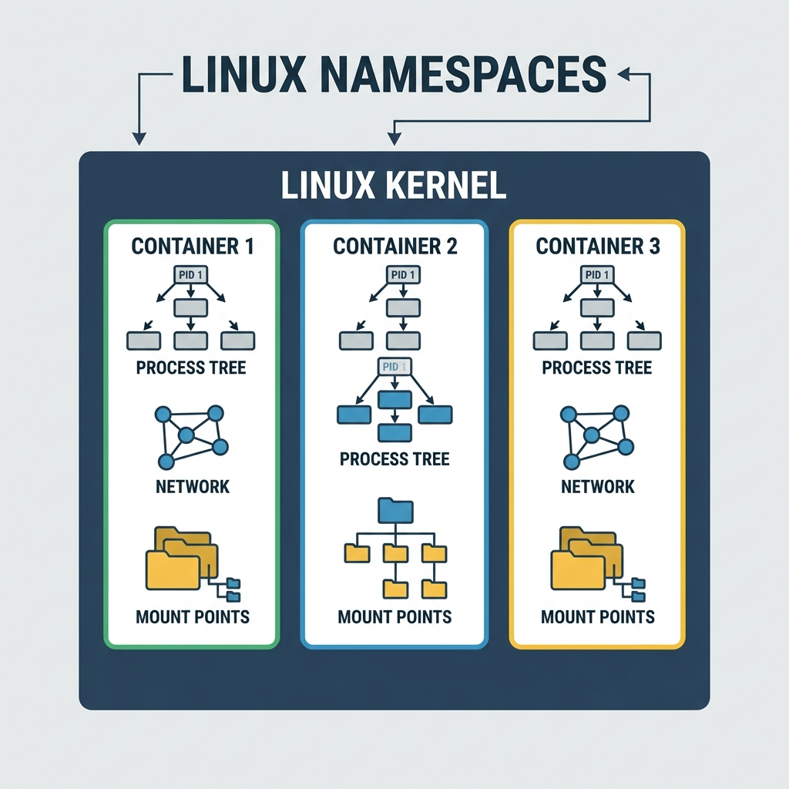

# Understanding Containerization and Linux Isolation Mechanisms

## Introduction

Containerization has become a buzzword in modern software development, but few realize that it’s actually an old concept—much older than virtualization. Linux has provided built‑in isolation features since its early days. This tutorial explains the fundamental building blocks of containerization: the six Linux kernel namespaces and control mechanisms that make containers possible.

By the end of this guide, you’ll understand exactly what a container is under the hood, how processes are separated, and why Docker simply made these existing technologies more accessible.

---

## A Brief History: Containers Before Virtualization

Containerization isn’t new. It existed before virtualization gained market popularity. The Linux kernel (first released in 1991, but its roots go back to the 1960s with earlier Unix systems) always had mechanisms to separate processes, network interfaces, file systems, and users.

Virtualization became popular first because it was easier to market—running whole operating systems on top of a hypervisor was a clear concept. Containers, however, stayed in the background until Docker made them user‑friendly. But the core ideas were always there.

> **Analogy**  
> Virtualization is like building a completely new house inside an existing one (new foundation, walls, roof).  
> Containerization is like adding room dividers to an open floor plan—separate spaces, same structure.

---

## The Six Pillars of Linux Isolation

Linux provides six fundamental mechanisms that, when combined, give you a full container. Each mechanism controls access to a different type of resource.

### 1. NET – Network Namespace (The Address Book)

**What it does**  
Separates network interfaces, IP addresses, routing tables, and port numbers. Each network namespace has its own private set of network resources.

**How it works**  
Every time you install Docker or virtualization software, virtual network interfaces are created. Run `ifconfig` (Linux) or `ipconfig` (Windows) and you’ll often see more interfaces than physical ones.

**Example**  
Your laptop can be connected to Wi‑Fi (one IP) and Ethernet (another IP) at the same time. The `net` subsystem keeps these two networks separate—traffic on one doesn’t interfere with the other.

**Sockets**  
A socket is like a mailbox. Each process gets a socket identified by an **IP address + port number** (e.g., `192.168.1.10:8080`). Processes can write data into each other’s sockets only if permissions allow. The `net` library ensures that network separation is enforced at the operating system level.

---

### 2. PID – Process ID Namespace (The Identity Card)

**What it does**  
Each process receives a unique Process ID (PID). Processes can only see their own children, not sibling processes. They cannot access each other’s memory, registers, or cache.

**How it works**  
The operating system maintains a **Process Control Block (PCB)** for every process. The PCB contains the PID, memory map, open files, and more. Even though all processes descend from the initial kernel process, they are isolated from one another.

**Example**  
Think of a company hierarchy:
- The CEO (root process) creates a Vice President (child process).
- The VP creates a Manager (grandchild).
- The Manager creates Employees.

Employees know their direct manager, but they cannot see or modify the data of employees working for a different manager.

**Practical note**  
In Linux you can kill a process with `kill -9 [PID]`. In Windows, Task Manager shows the process tree—parents and their children. The inability of sibling processes to access each other’s memory is a core security feature.

---

### 3. MNT – Mount Namespace (The Library System)

**What it does**  
Separates file system mount points. Each mount namespace sees its own directory tree, even if they share the same physical disk.

**Understanding mounting**  
Mounting is the act of attaching a storage device (or a partition) to a directory (the *mount point*). After mounting, you can access the device’s files through that directory.

**Example – plugging in a USB drive**  
1. **Hardware detection** – The motherboard detects the USB drive and gives it a hardware name (e.g., `/dev/sdb1`).  
2. **Mounting** – You create an empty folder, say `/media/myusb`, and run `mount /dev/sdb1 /media/myusb`. Now the USB’s contents appear inside `/media/myusb`.  
3. **Unmounting** – Before removing the drive, you run `umount /media/myusb` to safely detach it.

**Finding the hardware name**  
In Linux, all hardware devices appear under `/dev/`. To identify a newly plugged USB drive, you can list `/dev/` before and after plugging it in—the new entry is your drive. Names like `/dev/sda`, `/dev/sdb` are common.

**Quick format vs. full format**  

| Operation | What happens | Can data be recovered? |
|-----------|--------------|------------------------|
| **Quick format** | Only the file system index (table of contents) is erased. The actual data remains on disk. | Yes, with special tools. |
| **Full format** | Every bit on the disk is overwritten (often with zeros or random data). | No. |

> **Why unmount before formatting?**  
> Formatting rewrites critical file system structures. If the device is mounted, the operating system might be reading or writing to it, leading to corruption. Unmounting first ensures a clean state.

**The slider on USB drives**  
Some USB drives have a physical slider that makes the drive read‑only. The slider physically covers one of the electrical contacts used for writing. When covered, the drive can only be read—no data can be written.

---

### 4. UTS – Unix Time Sharing (The Clock System)

**What it does**  
Separates hostname and domain name, and allows multiple users to share the same hardware through time slicing. UTS stands for **UNIX Time‑Sharing**.

**How time sharing works**  
A single CPU core can only run one instruction at a time. By switching between processes extremely fast (context switching), each user feels they have dedicated access. The switching is so quick that humans don’t notice.

**Context switching**  
Saving the current process’s state (registers, program counter) to memory, then loading another process’s state into the CPU.

**The Unix timestamp and the 2038 problem**  

Computers track time by counting seconds since **January 1, 1970 00:00:00 UTC** – this moment is called the Unix Epoch.

- On 32‑bit systems, the timestamp is stored in a **signed 32‑bit integer**.
- The maximum value is 2,147,483,647 seconds.
- That number will be reached in **the year 2038** (exact date: 03:14:07 UTC on 19 January 2038).

**What happens then?**  
The next second will overflow the integer, making it negative (wrapping to -2,147,483,648). The system will think the date is **13 December 1901** or **1 January 1970**, depending on implementation. This can break software that relies on correct dates.

> This is similar to the Y2K problem, but for Unix timestamps. Most modern 64‑bit systems have already solved it by using a 64‑bit time type (which will last for billions of years).

---

### 5. IPC – Inter‑Process Communication (The Message System)

**What it does**  
Allows isolated processes to communicate with each other using controlled methods. IPC is necessary because processes cannot directly access each other’s memory.

**Two main methods**

#### a) Shared memory (blackboard pattern)
- A region of memory is shared between processes.
- One process writes data, another reads it.
- Example: Global variables in C or memory‑mapped files.

#### b) Message passing (queue pattern)
- Processes send messages to each other through queues.
- Messages are usually **FIFO** (First In, First Out) – the oldest message is processed first.
- Used in banking, email servers, and many distributed systems.

**Email protocol analogy**  
- **SMTP** (Simple Mail Transfer Protocol) – sending emails.  
- **IMAP** (Internet Message Access Protocol) – reading/accessing emails on a server.  
- **POP** (Post Office Protocol) – downloading emails to your local machine.  

All these protocols rely on ordered message queues. If a mail server crashes and restarts, it processes the queue in order—no random access.

**Why order matters**  
Imagine a bank transaction:  
1. Debit $100 from account A (message 1)  
2. Credit $100 to account B (message 2)  

If message 2 is processed before message 1 due to a broken queue, the system could incorrectly show a negative balance. That’s why IPC for critical systems must preserve order.

---

### 6. User and Group IDs (The Access Control System)

**What it does**  
Separates users and groups, each with different permissions.

**Basic concepts**  
- **User ID (UID)** – unique identifier for each user account.  
- **Group ID (GID)** – a set of users that share permissions.  

**Permission levels**  
| Level | Meaning | Analogy in Java |
|-------|---------|------------------|
| **Public** | Any user can access | `public` |
| **Group** | Only members of a specific group can access | `protected` |
| **Private** | Only the owner can access | `private` |

**Example**  
When you install software, you are often asked: *“Install for all users or only for yourself?”*  
- **All users** – makes the program world‑accessible (public).  
- **Only yourself** – restricts access to your UID (private).

**Groups in action**  
A company might have groups: `developers`, `managers`, `hr`. Files marked as readable by the `developers` group can be seen by all developers but not by HR.

---

## Bringing It All Together – What Is a Container?

A **container** is simply a combination of the six isolation mechanisms described above:

1. **NET** – separate network stack  
2. **PID** – separate process tree  
3. **MNT** – separate file system mounts  
4. **UTS** – separate hostname and time‑sharing context  
5. **IPC** – controlled communication channels  
6. **User/Group** – separate user and group IDs  

When you run a container, the operating system creates a new set of these namespaces for that container. From inside the container, it looks like a complete, isolated Linux system. But in reality, it’s sharing the same kernel as the host.

> **Why Docker is not a revolution, but an evolution**  
> Docker didn’t invent containers. It created a user‑friendly interface and image format that made containers easy to build, share, and run. Under the hood, it uses exactly the Linux mechanisms described here.

---

## Everything Is Read and Write

At the hardware level, every operation a computer performs is either **reading** or **writing**.

| Operation | What happens |
|-----------|---------------|
| Visit a website | The server writes data to your RAM; your browser reads it. |
| Save a file | The operating system writes data from memory to disk. |
| Increment a counter | Read the current value → add 1 → write back. |
| Run a CPU instruction | Read instruction from memory → execute → write results to registers or memory. |

Even a complex operation like rendering a 3D game is, at its core, billions of read and write cycles. This fundamental truth helps you understand why isolation mechanisms work at such low levels.

---

## Practical Commands Reference

| Command | Purpose |
|---------|---------|
| `ifconfig` (Linux) / `ipconfig` (Windows) | Show network interfaces |
| `ps aux` | List all running processes with PIDs |
| `kill -9 [PID]` | Forcefully terminate a process |
| `ls /dev/` | List hardware devices |
| `mount` | Show currently mounted file systems |
| `umount [mount_point]` | Unmount a device |
| `date +%s` | Display current Unix timestamp (seconds since 1970) |
| `whoami` | Show your current user ID |
| `groups` | Show groups you belong to |

---

## Summary

- **Containerization is not new** – Linux has provided isolation since the early days.
- **Six key mechanisms** – NET, PID, MNT, UTS, IPC, and User/Group – work together to create containers.
- **Mounting** is attaching a storage device to a directory; formatting prepares the file system.
- **The 2038 problem** affects 32‑bit systems when the Unix timestamp overflows.
- **IPC** requires ordered queues (FIFO) for consistency in critical systems like banking.
- **Everything is read and write** – a simple principle that underlies all computing.

Now when you run `docker run`, you’ll know exactly what’s happening behind the scenes: Linux is creating a set of namespaces that isolate your container using features that have been there for decades.

---

## Recommended Online Tutorials

- **Nigel Poulton**: [Containers Under The Hood: Namespaces (YouTube)](https://www.youtube.com/watch?v=-YnMr1lj4Z8)
- **Just me and Opensource**: [Linux Namespaces and Cgroups (YouTube)](https://www.youtube.com/watch?v=sK5i-N34im8)

---

## Useful Tips & Architect's Rules

- **Cgroups vs Namespaces**: Namespaces dictate *what* a process can see (isolation). Control Groups (Cgroups) dictate *how much* a process can use (resource limits like RAM and CPU). You need both to build a true container.
- **The PID 1 Problem**: Inside a container, the main application is running as PID 1. If PID 1 dies, the namespace collapses and the container exits. 
- **Privileged Containers**: Running a container with the `--privileged` flag effectively disables most namespace and cgroup boundaries, giving the container root access to the host machine. Never do this in production unless absolutely necessary (e.g., nested Docker-in-Docker CI/CD pipelines).