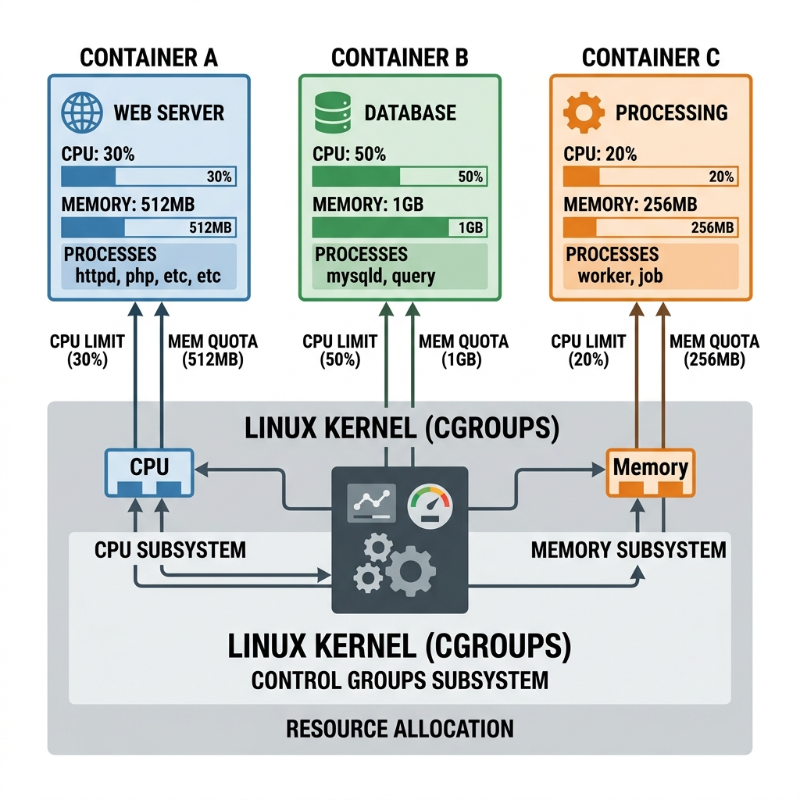

# Understanding Container Isolation, cgroups, and Virtual Machine Management

## A Self‑Contained Tutorial

This tutorial explains how containers and virtual machines achieve isolation, how resources are limited and shared, and how to manage multiple VMs efficiently. All examples are self‑contained—no prior lecture attendance required.

---

## 1. How Containers Achieve Isolation

Containers are like separate apartments in the same building. They share the building’s foundation (the host operating system kernel) but each has its own private space. This “private space” is created using seven Linux **namespaces** and **control groups (cgroups)**.

### The Seven Namespaces

| Namespace | Purpose | Real‑world analogy |
|-----------|---------|--------------------|
| **PID** (Process) | Each container sees only its own processes | You see only your family members, not the whole building |
| **NET** (Network) | Each container gets its own IP, ports, routing table | Each apartment has its own WiFi and door number |
| **MNT** (Mount) | Each container has its own filesystem view | Your kitchen and bathroom are yours only |
| **USER** | A container can have its own root user | Your keys don’t open other apartments |
| **IPC** | Inter‑process communication is container‑local | Your intercom works only inside your apartment |
| **UTS** (Hostname) | Each container can have a different hostname | “The Blue Apartment” vs “The Red Apartment” |
| **cgroups** | Resource limits (CPU, RAM, disk I/O) | Building management limits how much electricity you can use |

> Without cgroups, one container could consume all the RAM or CPU and starve others. cgroups prevent that.

---

## 2. cgroups – The Resource Police



Control groups (cgroups) are a Linux kernel feature that limits, accounts for, and isolates resource usage of a collection of processes.

### Simple Example

Assume a physical machine with **16 GB RAM** and **4 CPU cores**.  
You run a database container and a web server container.

**Without cgroups**  
- The database container might allocate 14 GB RAM.  
- The web server gets only 2 GB and starts swapping – performance collapses.

**With cgroups**  
- Database container → max 8 GB RAM, 2 CPU cores  
- Web server container → max 4 GB RAM, 1 CPU core  
- System reserve → 4 GB RAM, 1 CPU core  

If the database tries to exceed 8 GB, the kernel either throttles it or kills the offending process.

### How cgroups are used in practice

When you run a container with Docker or Kubernetes, you specify limits:

```bash
docker run --memory="512m" --cpus="1.5" my-app
```

Behind the scenes, the container runtime creates cgroup entries that enforce those limits.

---

## 3. Resource Reservation – Why You Cannot Use 100% of a Physical Machine

Suppose you have a physical server with:

- 16 GB RAM  
- 4 CPU cores  
- 512 GB SSD  

You want to create four virtual machines (VMs), each with 4 GB RAM. **Can you?**

**No.** The host operating system (or hypervisor) itself needs resources.

- A general‑purpose OS (Windows) may need 4–8 GB just for itself.  
- A lightweight hypervisor may need 0.5–1 GB.  
- Even a minimal Linux server needs 1–2 GB.

So the usable RAM for VMs is **12–14 GB** at most.  
You can create three VMs of 4 GB each, not four.

> **Rule of thumb:** Always reserve memory for the host / hypervisor layer.

---

## 4. Homogeneous vs Heterogeneous VM Collocation

Imagine you have six VMs with different workload patterns:

- **Odd‑numbered VMs** – Compute‑intensive (heavy CPU usage)  
- **Even‑numbered VMs** – I/O‑intensive (heavy disk or network usage)

You can host only **two VMs per physical machine**. You have three physical machines (PM1, PM2, PM3).  
What is the best placement?

### Strategy A – Homogeneous collocation

- PM1: VM1 (compute) + VM3 (compute)  
- PM2: VM2 (I/O) + VM4 (I/O)  
- PM3: VM5 (compute) + VM6 (I/O)

**Problem:**  
PM1’s CPUs are constantly contested – both VMs fight for the same compute resources.  
PM2’s I/O channels are saturated – both VMs fight for disk bandwidth.  
Only PM3 is balanced.

### Strategy B – Heterogeneous collocation

- PM1: VM1 (compute) + VM2 (I/O)  
- PM2: VM3 (compute) + VM4 (I/O)  
- PM3: VM5 (compute) + VM6 (I/O)

**Result:**  
Every physical machine contains one compute‑intensive and one I/O‑intensive VM.  
While the compute VM uses the CPU, the I/O VM can use disk and network – they do not contend for the same resources.

> **Key takeaway:** Mix workloads of different resource types on the same physical host to maximise utilisation.

---

## 5. Virtual Machine Management (VMM) – Key Challenges

A Virtual Machine Manager (also called a hypervisor manager or cloud orchestrator) must handle many tasks beyond simply creating VMs.

### 5.1 Monitoring VMs

A VM is both:
- A **process** on the host machine  
- A **complete operating system** with its own processes

| Where you monitor | What you see | Limitations |
|------------------|--------------|--------------|
| Inside the VM | Processes inside the VM | Monitoring agent consumes resources (who pays?), cannot see other VMs |
| Outside (on the host) | The VM as a single process | Cannot see internal application logs, but perfect for billing and resource allocation |

**Practical approach:**  
- **Host‑level monitoring** for resource allocation and billing.  
- **Guest‑level monitoring** (optional, agent‑based) for application‑level metrics.

### 5.2 Unpredictable Workloads

A VM’s workload can change over time.

**Example:**  
- Day 1: VM1 uses 90% CPU, 10% I/O  
- Day 2: VM1 uses 10% CPU, 90% I/O  

If VM1 was originally collocated with another I/O‑intensive VM, after the change both VMs fight for I/O resources. Performance degrades.

**What a good VMM does:**  
- Detects workload pattern shifts.  
- Automatically migrates VMs to better‑suited physical hosts.  
- Requires **self‑organising** behaviour – the user should not need to intervene.

### 5.3 Quality of Service (QoS) Guarantees

Some workloads are **critical** (real‑time transactions), others are **background** (batch processing).

**Example – Banking system:**  
- Critical: Fund transfers, ATM withdrawals – must be fast and predictable.  
- Non‑critical: End‑of‑day interest calculation, report generation.

**Without QoS:** A batch job during lunch hour can slow down ATM transactions.  
**With QoS:** Resources are guaranteed for critical tasks; batch jobs use only leftover capacity.

### 5.4 Fault Tolerance and High Availability

If a VM crashes, the VMM should:

1. Detect the failure.  
2. Provision a replacement VM (possibly on a different physical host).  
3. Restore state from the last checkpoint or replica.  

To achieve this, the VMM often maintains **replicas** of VMs across different physical machines or even different availability zones. Replicas must be kept **synchronised** – this adds complexity.

### 5.5 Scalability of the VMM Itself

The VMM is a central manager. If it becomes a single point of failure or cannot handle thousands of VMs, the whole cloud platform suffers.  

A scalable VMM must:
- Distribute its own state across multiple nodes.  
- Handle replication and synchronisation efficiently.  
- Continue operating even if some manager nodes fail.

---

## 6. Containers vs VMs – A Quick Comparison

The same management concepts apply to containers, but with differences:

| Aspect | Virtual Machines | Containers |
|--------|------------------|------------|
| **Isolation** | Strong – separate kernels | Weaker – shared host kernel |
| **Overhead** | High (GBs per VM) | Low (MBs per container) |
| **Startup time** | Minutes | Seconds |
| **Replication cost** | Copy full OS (many GBs) | Share base image (few MBs) |
| **Orchestrator example** | vSphere, OpenStack | Kubernetes, Docker Swarm |

**Example – replicating 10 instances of an application:**  
- **VMs:** 10 × 10 GB = 100 GB disk space, 10 minutes startup.  
- **Containers:** 1 GB shared base image + small per‑container layers, 10 seconds startup.

> Because containers are lighter, management tasks like replication and migration are much faster.

---

## 7. CPU Frequency Capping – A Nuanced Topic

Can you limit the **clock frequency** (e.g., GHz) of a CPU core assigned to a VM?

**Yes, but indirectly.**

The host operating system controls the actual physical CPU frequency using **governors**:

- `powersave` – always minimum frequency  
- `performance` – always maximum frequency  
- `ondemand` – increase frequency when utilisation is high  

A VM sees **virtual CPUs**. The host can cap the effective frequency by:
- Limiting the CPU time the VM receives (via cgroups).  
- Restricting the VM to a set of physical cores that are configured to run at a lower frequency.  

The VM itself thinks it is running at a certain clock speed, but the host hardware may run slower. This is a common technique in cloud environments to offer “burstable” CPU performance.

---

## Summary – What You Should Remember

1. **Containers use seven Linux namespaces** – six for isolation (PID, NET, MNT, USER, IPC, UTS) plus **cgroups** for resource limits.  
2. **cgroups** are the “resource police” – they prevent one container from starving others.  
3. **You cannot use 100% of a physical machine** – the host and hypervisor need resources too.  
4. **Heterogeneous VM collocation** (mixing compute‑intensive with I/O‑intensive) improves utilisation.  
5. **VMM challenges** include monitoring, unpredictable workloads, QoS, fault tolerance, and scalability.  
6. **Containers are lighter** but share the kernel – they trade isolation for efficiency.  
7. **CPU frequency capping** is possible through host‑level governors and cgroup CPU limits.

---

## Further Practice

Try these small experiments (on a Linux machine with Docker installed):

```bash
# Run a container with memory limit
docker run --memory=256m --stress --vm 1 --vm-bytes 500M

# Observe how the kernel reacts (the process will be killed)

# Run two containers with CPU limits
docker run --cpus=0.5 --name=limited &
docker run --cpus=2 --name=generous &

# Use 'docker stats' to see the difference in CPU allocation
```

These exercises will reinforce how cgroups enforce the rules described in this tutorial.

---

## Recommended Online Tutorials

- **IBM Technology**: [Linux Cgroups Explained (YouTube)](https://www.youtube.com/watch?v=sK5i-N34im8)
- **Container Camp**: [Deep Dive into Cgroups (YouTube)](https://www.youtube.com/watch?v=z7mOQFcgJZA)

---

## Useful Tips & Architect's Rules

- **The OOM Killer**: If a container violates its Memory cgroup limit, the Linux kernel invokes the "Out Of Memory (OOM) Killer" and instantly terminates the container process. CPU limits behave differently; exceeding a CPU quota merely results in the CPU being throttled, slowing the container down but not killing it.
- **Eviction vs OOM**: Kubernetes has its own eviction watcher. If a Node's overall physical memory runs low, Kubelet will start evicting containers *before* the Linux kernel OOM Killer gets involved, prioritizing the destruction of "BestEffort" containers first.