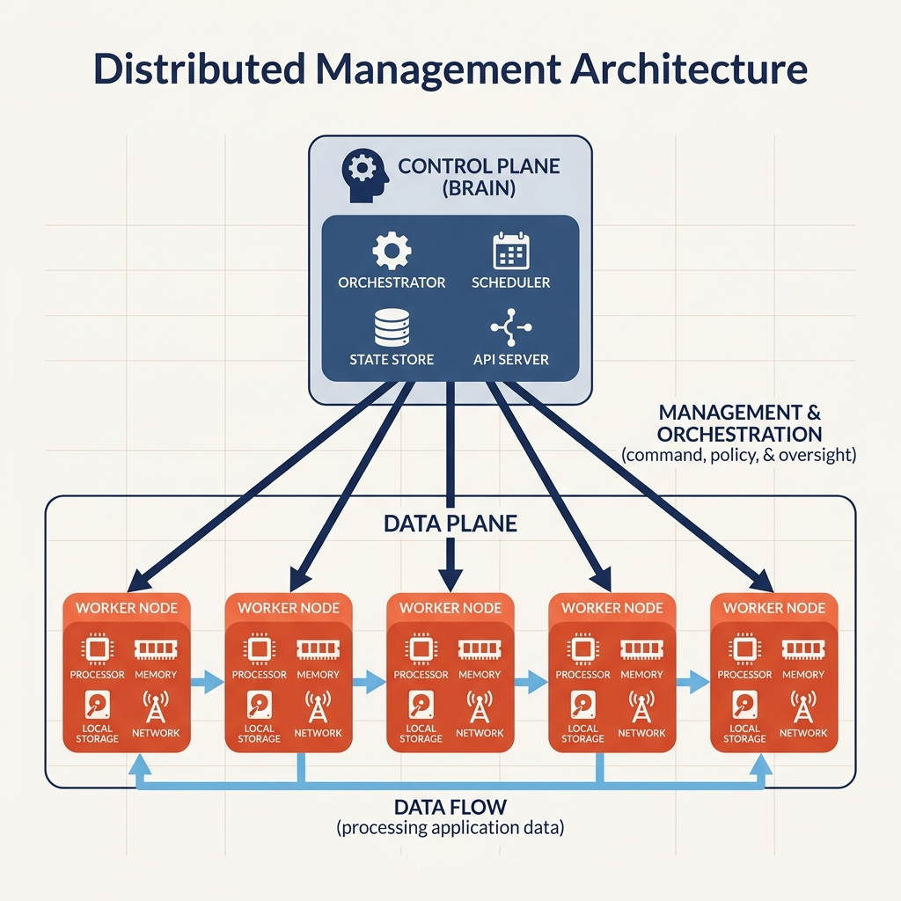

# Distributed Management in Cloud Computing

## A Self-Contained Tutorial

Welcome! This tutorial will help you understand how multiple computers work together in a distributed system. By the end, you'll know:

- Why distributed systems need management
- The difference between client‑server and peer‑to‑peer architectures
- How push and pull notifications really work
- Why there are no “pure” systems in the real world

Let’s start with a simple question: **What happens when you order food from a delivery app?**

---

## 1. What Makes a System “Distributed”?



Imagine a large online store during a sale. When you search for a product, your request does not go to just one computer. It goes to **hundreds of computers working together**.

**Think of it like a busy restaurant kitchen:**
- Multiple chefs (servers) cook different dishes.
- Waiters (clients) take orders from customers.
- The head chef (leader) coordinates everything.
- If one chef is absent, others cover the work.

A distributed system is exactly that – many independent computers (nodes) that cooperate to get a job done.

### Why Do We Need a Leader?

Without a leader, every chef might cook whatever they want. You would end up with pasta instead of biryani.  
In a data centre, a **leader node** takes charge. It makes sure all systems work together to fulfil a request (e.g., book a train ticket, process a payment, or serve a web page). If every node did its own thing, chaos would follow.

---

## 2. Client–Server Architecture

### The Classic Model

This is the most fundamental architecture in computing.

- **Server** – a computer that provides services or resources.
- **Client** – a computer that requests services or resources.

```
Client  -------------------->  Server
        "I want a pizza"         
        <--------------------   "Here's your pizza"
```

**Key points:**
- The client initiates the request.
- The server responds.
- The server usually has more resources (storage, CPU, data).

### Who Is the Leader?

At first glance, the client seems to be “ordering”. But the server holds the services and data that many clients depend on.  
Think of your home cook: you have the ingredients (infrastructure), but the cook has the skills (services). Without the cook, you have ingredients but no meal. Without you, the cook has no job. In a distributed system, the **server is the leader** because it provides the shared resource.

### The Single Point of Failure

If the server fails, **everything stops**:

```
Server -----> Client A
          ---> Client B   (if server dies, all clients die)
          ---> Client C
```

**Solution: replicate the server**  
Use two or more servers. If one fails, another takes over. But now you have a new challenge: keeping all servers in sync.

```
Server 1 -----> Client A
Server 2 -----> Client B   (no single point of failure)
Server 3 -----> Client C
```

---

## 3. Peer‑to‑Peer Architecture

### The Decentralised Alternative

**Peer‑to‑peer (P2P)** means all nodes are equal. No single machine is in charge.

**Analogy: a book swap club vs. a library**
- **Library (client‑server)** – one central building. Everyone borrows from there. If the library closes, nobody gets books.
- **Book swap club (P2P)** – everyone owns books. You borrow from neighbours. If one person leaves, others still share.

### The Reality: Even Torrents Are Not Pure P2P

Many people think torrents are pure peer‑to‑peer. They are not. Let’s see how a torrent download really works:

1. You download a `.torrent` file from a **website** (client‑server).
2. The file contains **tracker** information (a central server).
3. The tracker keeps a list of all peers and seeds (centralised coordination).
4. You download pieces from many peers (this part is P2P).
5. After the download, you become a seed and announce that to the tracker (client‑server again).

**The truth:** Every P2P system uses some centralised component for discovery, coordination, or initial setup.

### Client‑Server vs. Peer‑to‑Peer – At a Glance

| Aspect                | Client‑Server                | Peer‑to‑Peer                     |
|-----------------------|------------------------------|----------------------------------|
| Control               | Centralised                  | Decentralised                    |
| Single point of failure | Yes (server)                 | No                               |
| Coordination          | Easy (one authority)         | Complex (need consensus)         |
| Scalability           | Limited by server capacity   | Grows with the network           |
| Real‑world example    | Online store, IRCTC, banking | Torrents, blockchain (hybrid)    |

---

## 4. The Global Clock Problem

### Can We Use Time to Coordinate?

One idea for coordination is a **global clock** – every node agrees on the exact time.  
The problem: **global clocks do not exist in real distributed systems.**

### Why Not?

Two computers cannot perfectly synchronise their clocks. There will always be tiny differences.  
Example:
- Computer A: “I sent a message at 10:00:00.001”
- Computer B: “I received it at 10:00:00.000”

Which is correct? Did the message arrive before it was sent? This is impossible in physics, but without a global clock we cannot tell the true order.

### Logical Clocks (Lamport’s Algorithm)

Instead of real time, we use **event counters**:
- Event 1 (A sends) → counter = 1
- Event 2 (B receives) → counter = 2
- Event 3 (B responds) → counter = 3

We don’t know the real time, but we know the **order** of events. That is often enough for coordination.

---

## 5. Push vs. Pull Notifications

### What’s the Difference?

**Pull notification** – the client initiates:  
`Client: "Hey server, anything new for me?"`  
`Server: "Yes, here is your update."`

**Push notification** – the server initiates:  
`Server: "Hey client, here is an update!"`

**Analogy: checking mail**
- **Pull** = you walk to the mailbox every morning. You control when to check, but you might miss urgent mail.
- **Push** = the doorbell rings when mail arrives. Instant, but someone needs to know your address.

### The Secret: Every Push Starts with a Pull

How does a server know where to push?  
1. You install an app on your phone.
2. The app **initiates contact** (pull) to register.
3. The app tells the server: “My device ID is XYZ, my current IP is 203.0.113.5.”
4. The server stores that information.
5. Later, the server can **push** notifications using that stored info.

So even “push” relies on an initial “pull”.

### The IP Address Challenge

Your phone’s IP changes often – when you move between cell towers, switch Wi‑Fi, or restart your router.  
How does the server keep track?

**Solution:** The app periodically performs a pull (or a lightweight keep‑alive). Each time it contacts the server, it says “my current IP is …”. The server updates its records. Then future pushes go to the new IP.

### When to Use Push vs. Pull

| Scenario                | Better choice | Why                                   |
|-------------------------|---------------|---------------------------------------|
| News alerts             | Push          | Immediate delivery needed             |
| Email                   | Pull          | You check when convenient             |
| Emergency broadcast     | Push          | Critical information                  |
| Software updates        | Pull          | You choose when to download large files |
| Stock price alerts      | Push          | Time‑sensitive                        |
| App store updates       | Pull          | Not urgent, large size                |

---

## 6. The IP Address Dance – Both Sides Can Change

It is not only clients that change IP addresses. **Servers can change too.**

- **Server IP changes** happen when a cloud instance restarts, maintenance occurs, or a load balancer redirects traffic.
- **Client IP changes** happen when a mobile device roams, a laptop switches networks, or a router reboots.

### How to Handle Server IP Changes

**Solution 1: DNS (Domain Name System)**  
The client always knows a name like `api.myapp.com`. DNS maps that name to the current server IP. When the server IP changes, update the DNS record. Clients automatically use the new IP on their next lookup.

**Solution 2: Load Balancer**  
Place a load balancer with a fixed IP in front of your servers. Clients talk only to the load balancer. The load balancer forwards requests to the actual servers (which can change freely).

```
Client --> Load Balancer (fixed IP) --> Server 1 (may change)
                                     --> Server 2 (may change)
                                     --> Server 3 (may change)
```

### How to Handle Client IP Changes

The same principle works in reverse:  
1. A client’s IP changes (unannounced).  
2. The next time the client makes **any** request (pull), the server notices “this request comes from a different IP for the same user”.  
3. The server updates its internal record.  
4. Future pushes go to the new IP.

No special magic – just regular communication keeps everything in sync.

---

## 7. No Pure Systems – Everything Is a Hybrid

This is the most important insight: **there is no pure client‑server and no pure peer‑to‑peer.**

- **Client‑server systems** often use multiple servers (replication) and load balancers. That is a form of decentralisation inside a centralised model.
- **Peer‑to‑peer systems** always rely on some centralised elements for bootstrapping, discovery, or coordination.

### Example: Blockchain

Blockchain is often called “pure P2P”. But look closely:
- **Miners** – special nodes that validate transactions (like servers).
- **Regular nodes** – mostly act as clients.
- **Consensus protocols** – effectively elect a leader for each block.
- **Wallets** – client software that talks to the network.

Even blockchain uses hierarchy and centralised components (e.g., DNS seeds, checkpoint servers).

### The Takeaway

Every distributed system is a **hybrid**. The art is to choose the right balance for your needs:
- **Need strong consistency and easy management?** Lean toward client‑server.
- **Need resilience and scale?** Lean toward P2P, but accept some central coordination.

---

## 8. Real‑World Examples

### Example 1: How a Messaging App Sends Instant Notifications

1. You install the app.  
2. The app registers with the operating system’s push service (Google FCM or Apple APNS) – this is a **pull** to obtain a device token.  
3. The app sends that token to the messaging server (another **pull**).  
4. When a friend sends you a message, the server tells the push service: “Send this to token XYZ”.  
5. The push service **pushes** the notification to your phone.  

Even though you see a “push”, it started with two pulls.

### Example 2: How an Online Store Manages Orders

- You place an order – your browser **pulls** the order page and submits data.
- The store’s servers coordinate internally (leader‑follower pattern).
- When your order status changes (shipped, out for delivery), the server **pushes** a notification to you (using the registered device token).

### Example 3: Torrent Download – The Hybrid in Action

1. Find a `.torrent` file on a website – **client‑server**.
2. Open the file in a torrent client – the client contacts a **tracker** (central server) – **client‑server**.
3. The tracker returns a list of peers – **client‑server**.
4. Download pieces from those peers – **P2P**.
5. After completion, announce to the tracker that you are a seed – **client‑server**.

No pure P2P. No pure client‑server.

---

## Summary of Key Concepts

| Concept                     | Summary                                                                 |
|-----------------------------|-------------------------------------------------------------------------|
| **Distributed system**      | Multiple computers cooperating. Needs a leader to avoid chaos.         |
| **Client‑server**           | Server leads, clients request. Single point of failure (solved by replication). |
| **Peer‑to‑peer**            | All nodes equal. Complex coordination. Always has some central elements. |
| **Global clock**            | Does not exist in practice. Use logical clocks (event order) instead.   |
| **Push vs. Pull**           | Pull = client asks. Push = server sends. Every push starts with a pull. |
| **IP address changes**      | Solved by periodic pull (client) and DNS/load balancer (server).        |
| **No pure systems**         | Every real system is a hybrid. Choose the right mix for your problem.   |

---

## A Memory Aid – The Restaurant Chain

| Component          | Restaurant Analogy          | Computing Equivalent          |
|--------------------|-----------------------------|-------------------------------|
| Customers          | People who order             | Clients                       |
| Waiters            | Distribute orders            | Load balancers                |
| Chefs              | Cook food                    | Servers                       |
| Head chef          | Coordinates the kitchen      | Leader node                   |
| Kitchen            | Place where cooking happens  | Data centre                   |
| Takeout (pick up)  | You come to get food         | Pull notification             |
| Delivery           | Food comes to you            | Push notification             |

---

## Final Thoughts

Distributed management is about answering four fundamental questions:

1. **Who coordinates the work?** (Leader election)  
2. **How do components communicate?** (Client‑server vs. P2P)  
3. **How do we handle failures?** (Replication, redundancy)  
4. **How do we maintain state across changing IPs?** (Pull to update, DNS, load balancers)

Remember: **There is no perfect system.** Every architecture is a trade‑off between simplicity, reliability, and scalability. The best engineers know when to lean on a central server and when to let nodes work as peers.

Now you are ready to design your own distributed applications – and you know that even the most “decentralised” system hides a little bit of central coordination under the hood.

---

## Recommended Online Tutorials

- **ByteByteGo**: [Distributed Systems Architecture Explained (YouTube)](https://www.youtube.com/watch?v=Y6Ev8GIlbxc)
- **Gaurav Sen**: [System Design Basics (YouTube)](https://www.youtube.com/watch?v=m8Icp_Cid5o)

---

## Useful Tips & Architect's Rules

- **The Myth of "Stateless"**: True stateless architectures don't exist in business. What we call a "stateless" app tier simply pushes the hard work of state management (sessions, carts, preferences) down into a highly available distributed database or caching layer (like Redis).
- **Control Plane vs Data Plane**: Treat these two entirely differently. The Control Plane (the "brain", e.g. Kubernetes API server) needs strict consistency and high security. The Data Plane (the "muscle", e.g. the Envoy Proxies routing gigabits of user traffic) needs extreme latency optimization and massive horizontal scalability.