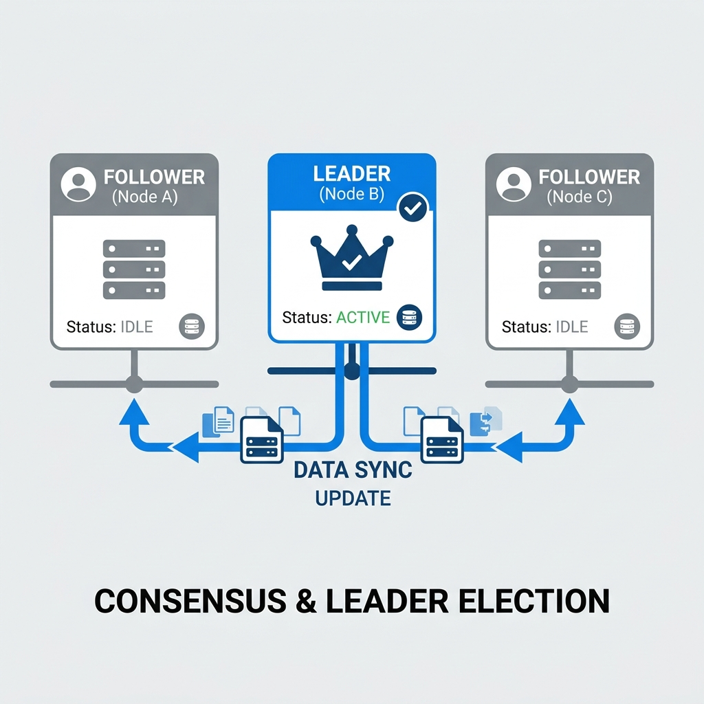

# Distributed Systems: Leader Election, Replication, and Dynamic Resource Allocation

## Introduction

In a distributed system, multiple independent computers (nodes) work together to achieve a common goal. But how do they coordinate without a central boss? How do they agree on who is in charge? And how do they keep their data consistent when some nodes fail?

This tutorial answers these questions using practical examples and simple analogies. You’ll learn about:

- Why distributed systems need a leader
- How to elect a leader when all nodes are equal
- How replication improves reliability (and creates new problems)
- How to resolve conflicts between replicas
- How to dynamically allocate resources and migrate virtual machines

Let’s start with a familiar situation.

---

## 1. The Problem of No Leader

Imagine four friends going on a road trip. They have one car, all have valid driving licenses, and all know the route perfectly. They are **equal** in every way. Someone must drive. How do they decide?

If everyone yells “I’ll drive!” at the same time, confusion follows. One friend may think Alice is driving, another thinks Bob is driving. The car never leaves the driveway.

**This is exactly the leader election problem in distributed systems.**

### 1.1 Why a Leader?

In a client–server architecture, the server is the natural leader. It tells clients what to do. But in a peer‑to‑peer (P2P) system (like BitTorrent), there is no built‑in leader. Yet even BitTorrent uses a central tracker (a lightweight server) to help peers find each other. Once peers have the initial information, they communicate directly.

A leader (also called primary, master, or coordinator) brings order:
- Everyone follows the leader’s latest information.
- Conflicts are avoided because only the leader makes final decisions.

### 1.2 The “I Am the Leader” Trap

A naive approach: any node can announce “I am the leader” to all others. But in a distributed system, messages take time, and there is no global clock. Two nodes may announce at the same time.

**Example:** Nodes A and C both decide there is no leader. A sends “I am leader” to B, C, D. C sends “I am leader” to A, B, D. B receives A’s message first and accepts A as leader. D receives C’s message first and accepts C as leader. Now half the network follows A, half follows C – a split‑brain situation. Recovery is messy.

We need a method that guarantees **exactly one leader** and that **everyone knows who it is**.

---

## 2. A Simple Solution: The Token Ring

Back to the road trip analogy. One friend says: *“Whoever has the car key drives.”* That’s the insight.

In a distributed system, we can create a single **token** – a special packet of data. The token travels from node to node in a fixed order (a ring). The node holding the token is the leader.

### How it works

1. Initially, the token is placed on node A.
2. A announces to all other nodes: “I have the token, so I am the leader.”
3. A holds the token for a predefined time (e.g., 20 seconds), then passes it to B.
4. B becomes the leader, announces itself, holds the token for 20 seconds, then passes to C.
5. The cycle repeats: A → B → C → D → A → …

**Why this works:**
- **No conflict:** Only one token exists, so only one leader at any moment.
- **Fairness:** Every node gets a turn.
- **No global clock needed:** Order is determined by the token’s path, not by message arrival times.

This is known as a **token‑based leader election** algorithm. It is simple and effective for small to medium‑sized systems.

---

## 3. Replication: More Copies, More Reliability

A single leader is a **single point of failure**. If the leader crashes, the entire system may stop. To increase reliability, we create **replicas** – copies of the leader’s data.

### 3.1 How Many Replicas?

Consider two scenarios:
- Node A has **5 replicas** (6 copies total).
- Node B has **2 replicas** (3 copies total).

| Number of replicas | Reliability | Cost & complexity |
|--------------------|-------------|--------------------|
| More | Higher (tolerates more failures) | Higher (storage, sync traffic, maintenance) |
| Fewer | Lower | Lower |

A common rule: **More replicas can tolerate more simultaneous failures**.  
- 2 replicas (3 total) can tolerate 1 failure.  
- 5 replicas (6 total) can tolerate 2 failures (because a majority of 4 can still agree).

### 3.2 The Consistency Problem

Replicas are useless if they hold different data. Keeping them consistent is hard, especially when the leader fails in the middle of an update.

**Example:**  
- Three replicas: A1 (leader), A2, A3. All start with `X = 5`.  
- A1 receives a command to update `X` to `7`.  
- A1 successfully updates A3, so A3 now has `X = 7`.  
- Before A1 can update A2, A1 crashes permanently.

Now we have:
- A2: `X = 5`
- A3: `X = 7`

**Who is correct?** The leader is dead and cannot confirm. This is a **consensus conflict**.

### 3.3 Resolving the Conflict – The Safe State Rollback

We have two possible paths:

1. **Majority rule:** If we had more replicas, we could take a vote. But here we have a tie (one says 5, one says 7). Tie cannot be broken without a leader.
2. **Roll back to the last known consistent state:** All three replicas *used to* agree on `X = 5`. That is a **safe state**. No node can dispute that `5` was once the agreed value.

Therefore, the system **rolls back** A3 from `7` to `5`. Why is this safer than forcing `7` onto A2?

- A3 might be malicious or faulty.
- The update to `7` might have been a mistake.
- The network might be partitioned – A2 cannot be reached, but forcing `7` would create inconsistency for any client reading from A2.

**Key principle:** In case of doubt, prefer a known consistent state over a potentially dangerous new value. Consistency is often more important than immediate availability.

---

## 4. Dynamic Resource Allocation

So far we assumed fixed tasks. In real systems, workloads change. Nodes may become slow, overloaded, or partially fail. **Dynamic resource allocation** adapts to these changes while tasks are running.

### 4.1 Load Balancing Analogy – Pizza Delivery

- **Static allocation:** Driver A covers zone 1, Driver B covers zone 2. If zone 1 gets 50 orders while zone 2 gets 2, Driver A is overwhelmed and orders are late.
- **Dynamic allocation:** A dispatcher monitors delivery times. When Driver A falls behind, the dispatcher reassigns some of his orders to Driver B (or a new driver C) *while the orders are still in progress*.

### 4.2 Virtual Machine Migration

In cloud environments, workloads run inside **virtual machines (VMs)** on physical machines (PMs). When a PM becomes overloaded, we can move a VM to another PM.

Two migration strategies:

#### Offline Migration
1. Shut down the VM.
2. Copy all its files and memory to the target PM.
3. Start the VM on the target.

- **Pros:** Simple, safe.
- **Cons:** Downtime – the VM is unavailable during the copy.

#### Live Migration
1. While the VM is still running, copy its memory pages to the target PM in the background.
2. After most pages are copied, pause the VM for a few milliseconds, copy the last changed pages, and resume on the target.

- **Pros:** Near‑zero downtime (users may not notice).
- **Cons:** Complex, potential data loss if the final switch fails.

### 4.3 When to Use Which?

| Scenario | Recommended migration |
|----------|----------------------|
| Critical service (payment gateway, search engine) | **Live migration** – downtime is unacceptable. |
| Internal reporting tool, batch job | **Offline migration** – schedule during off‑peak hours. |
| Very high load on the source PM | Live migration may be risky; offline migration with a maintenance window might be safer. |

### 4.4 Other Dynamic Factors

- **Service Level Agreements (SLA):** If a resource cannot be allocated within a promised time, the system may migrate the workload to a more powerful machine.
- **Jurisdictional constraints:** Some data must not leave a specific geographic region. Dynamic allocation must respect such rules.
- **Security layers:** Different workloads may require different levels of encryption or isolation.

---

## Summary

| Concept | Core idea | Real‑world analogy |
|---------|-----------|--------------------|
| Leader election | Choose a single coordinator among equal nodes | Rotating who holds the car key |
| Token ring | A single token determines the leader | Hot potato (whoever holds it leads) |
| Replication | Multiple copies for reliability | Multiple copies of a library book |
| Consistency conflict | Disagreement between replicas after a failure | Two librarians say different page numbers |
| Safe state rollback | Revert to the last agreed value | “Let’s go back to the last map we all trusted” |
| Dynamic allocation | Reassign work while tasks run | Pizza dispatcher reassigning deliveries |
| Live migration | Move a VM with near‑zero downtime | Changing a tire while the car rolls slowly |

**Final thought:** Building distributed systems is about managing trade‑offs – between reliability and cost, consistency and availability, simplicity and zero downtime. The tools you learned here (token‑based election, quorum, rollback, live migration) are the building blocks of resilient cloud architectures.

Now go build something that doesn’t break when things go wrong.

---

## Recommended Online Tutorials

- **The Secret Lives of Data**: [Raft Consensus Algorithm Explained (Interactive / YouTube)](https://www.youtube.com/watch?v=vYp4LYbnnW8)
- **Martin Kleppmann**: [Distributed Systems Lecture Series (YouTube)](https://www.youtube.com/watch?v=UEAMfLPZZhE)

---

## Useful Tips & Architect's Rules

- **The Split-Brain Problem**: Never build a 2-node cluster for databases that require leader election. If the network between them breaks, BOTH nodes will declare themselves the leader (Split-Brain) and start accepting conflicting writes. Always use an odd number of nodes (3, 5, 7) to guarantee a strict 'Quorum' (majority vote).
- **Raft over Paxos**: While Paxos was the academic gold standard for consensus algorithms for decades, Raft has become the industry standard (used by etcd, Consul, Kafka) simply because it prioritizes being *understandable* and *implementable* by normal software engineers. Elegance matters in architecture.