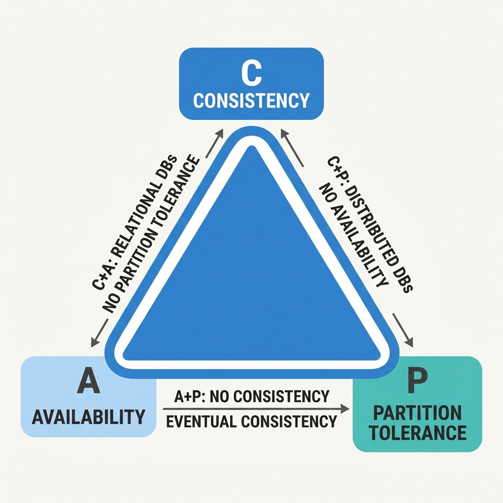
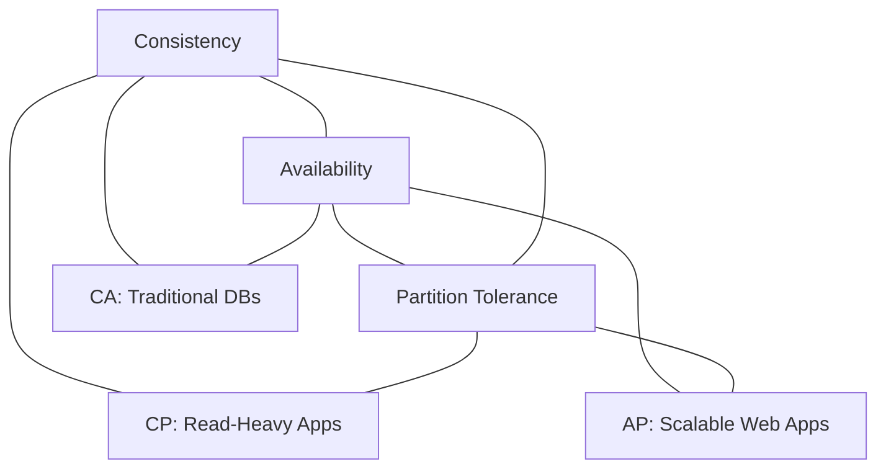

# Distributed Systems and the CAP Theorem: A Complete Tutorial

Welcome. This tutorial will teach you everything you need to know about distributed systems, why they are hard, and the fundamental trade‑off known as the CAP theorem. No prior distributed systems experience is required – only a basic understanding of databases and networks.

---

## 1. Why Can’t We Just Use One Big Computer?

Imagine you run a popular online store. At first, 10 customers per day is fine. Then you get 1,000, then 100,000. How do you handle the growth?

### Two ways to scale

**Vertical scaling (scale up)** – Make your single computer more powerful.  
- Add more RAM, faster CPUs, bigger disks.  
- There is a physical limit: you cannot put 10,000 GB of RAM in one server.  
- Cost grows exponentially.

**Horizontal scaling (scale out)** – Use many ordinary computers together.  
- Connect 100 laptops, each with 16 GB RAM → 1,600 GB total.  
- Cheaper and theoretically unlimited.  
- But now you have a new problem: **coordination**.

> Think of a restaurant:  
> - Vertical = one kitchen with 100 cooks – crowded and chaotic.  
> - Horizontal = 100 small kitchens (franchise) – but how do they share the same menu and inventory?

---

## 2. The Teamwork Problem – How Machines Fail to Sync

You have four people working on a project.  
- Person A updates the code at night but forgets to push to the shared repository.  
- Person B pulls the old code in the morning, makes changes, and pushes.  
- Now you have two conflicting versions. No one knows which is correct.

**This is exactly what happens in distributed systems.**  
Machines are like team members: they work independently, they can fail silently, and messages can be delayed or lost.

---

## 3. The Clock Problem – Why Time Is Your Enemy

You want to transfer $100 from Account X (in New York) to Account Y (in Tokyo).  
- Machine in New York debits $100.  
- Machine in Tokyo credits $100.

Seems simple. But what time did each operation happen?  
If the clocks on the two machines are not perfectly synchronised, you cannot order the events correctly.

### Why can’t we synchronise clocks perfectly?

Even with the fastest optical fibre, light takes time to travel.  
- New York → Tokyo: about 70 milliseconds one way.  
- Processing delays add more uncertainty.

**Einstein’s relativity** tells us: space and time are linked. If two machines are far apart, they **cannot** have identical clocks at the microsecond level. It is not a technology problem – it is a law of physics.

> In a single computer, you have a global clock and shared memory.  
> In a distributed system, there is **no global clock**. Every machine lives in its own time bubble.

---

## 4. The CAP Theorem – Pick Any Two

The CAP theorem says that a distributed data system can provide at most **two** of the following three guarantees at the same time:

| Property | What it means | Real‑world analogy |
|----------|---------------|---------------------|
| **Consistency (C)** | Every read receives the most recent write or an error. All nodes see the same data at the same time. | A bank account balance – you never see an old, incorrect value. |
| **Availability (A)** | Every request receives a (non‑error) response, without guarantee that it contains the most recent write. | A search engine – it always returns a page, even if the results are slightly stale. |
| **Partition Tolerance (P)** | The system continues to operate despite an arbitrary number of messages being dropped or delayed between nodes. | The internet – cables can be cut, routers can fail, but the remaining parts keep working. |

> **The theorem:** In the presence of a network partition (P), you must choose between consistency (C) and availability (A). You cannot have all three.

---

## 5. Visualising the Trade‑off



Imagine three database servers: **A**, **B**, and **C**. All hold a copy of the same value `X = 5`.

Now a network failure isolates **B** from **A** and **C**. We have two partitions: `{A, C}` and `{B}`.

A client updates `X` to `6` on partition `{A, C}`.  
- Partition `{A, C}` now has `6`.  
- Partition `{B}` still has `5`.

**If you want consistency (C):**  
You must reject the update to `X` until the partition heals, because you cannot safely make `B` see the new value.  
→ The system becomes **unavailable** for writes to `X`.

**If you want availability (A):**  
You allow the update on `{A, C}`.  
→ Now two different clients will see different values (`6` vs `5`). Consistency is lost.

**Partition tolerance (P)** means the system keeps running despite the broken network – which it does. But you cannot also keep both C and A.

---

## 6. Real Databases and Their CAP Choices

Different databases make different trade‑offs.

### Traditional SQL (Relational) – CA

- **Strong consistency** – transactions, foreign keys, serializable isolation.  
- **High availability** within a single node (or primary‑replica with synchronous replication).  
- **Weak partition tolerance** – if the network between replicas breaks, the system usually stops accepting writes to avoid inconsistency.

> Use for: banking, ticketing (e.g., airline seats), inventory management.

```sql
BEGIN TRANSACTION;
UPDATE accounts SET balance = balance - 100 WHERE id = 1;
UPDATE accounts SET balance = balance + 100 WHERE id = 2;
COMMIT;
-- During the transaction, the involved rows are locked (unavailable).
```

### MongoDB (Document store) – CP

- **Consistency** by default: writes go to a primary node, which then replicates to secondaries.  
- **Partition tolerant**: if a secondary is unreachable, the primary still works; when the secondary returns, it catches up.  
- **Availability** is reduced during failover (a few seconds where the primary is down and a new primary is elected).

```javascript
// MongoDB uses a primary-secondary model
db.accounts.updateOne({ _id: 1 }, { $set: { balance: 500 } });
// The write is acknowledged only after the primary commits it.
// Secondaries may lag, but reads can be directed to the primary for consistency.
```

### Cassandra (Column store) – AP

- **High availability** – any node can accept writes.  
- **Partition tolerant** – designed to survive multiple node and network failures.  
- **Weak consistency** – you may read stale data temporarily (eventual consistency).

```csharp
// Cassandra uses tunable consistency
INSERT INTO users (id, name) VALUES (1, 'Alice') USING CONSISTENCY ONE;
// The write succeeds as soon as one node acknowledges it.
// Another read may still see the old value for a short time.
```

> Use for: social media feeds, recommendation engines, IoT sensor data – where a slightly stale value is better than no response.

---

## 7. Consistency Is Not One‑Size‑Fits‑All

Not every application needs bank‑level consistency. There is a spectrum.

### Strong Consistency
- Every read returns the latest write.  
- Example: a seat reservation system – you cannot assign the same seat twice.

### Eventual Consistency
- If no new updates are made, all replicas will eventually converge.  
- Example: a social media post – your friend in another region may see it a few seconds later, but eventually they will.

### Causal Consistency
- If event A causally depends on event B (e.g., a comment on a post), then any node that sees A must also see B.  
- Unrelated events can be seen in different orders.

### Client‑Centric Consistency (Read Your Writes)
- You will always see your own updates, even if other users see stale data for a while.  
- Example: after you change your profile picture, you immediately see the new one; your friends may see the old one for a few minutes.

### Monotonic Reads
- Once you have read a value, you will never see an older version of that same value later.  
- Prevents “time travel” effects (e.g., seeing $100 after seeing $150).

---

## 8. Distribution Transparency – You Shouldn’t Have to Know

A well‑designed distributed system hides its complexity from you, the user or application developer. There are five kinds of transparency:

| Transparency | What is hidden |
|--------------|----------------|
| **Access** | Whether you are talking to one server or many. |
| **Location** | Where the server physically sits (same room, different continent, underwater). |
| **Replication** | Whether you are reading from a primary or a backup copy. |
| **Failure** | A server crashed and another took over – you never notice. |
| **Migration** | Data or virtual machines moved to another data centre while you were using them. |

> When you type a search engine’s URL, you don’t know which of thousands of servers answers. That is access transparency in action.

---

## 9. Types of Failures (More Than Just Crashes)

In a distributed system, failures are subtle:

- **Machine failure** – a server loses power or its disk dies.  
- **Message failure** – a request is sent but never arrives (or arrives so late it is useless).  
- **Link failure** – a network cable is cut, or a router misconfiguration partitions the network.  
- **Timing failure** – a server responds too slowly; the system treats it as dead.  

> A message that arrives after the deadline is the same as no message at all.  
> If you show up to a meeting 30 minutes late, you are effectively absent.

---

## 10. The Load Balancer – More Than Just Traffic Distribution

When you scale horizontally, you need a **load balancer** in front of your servers. Its jobs:

1. **Present a single entry point** – clients talk to one IP address.  
2. **Distribute requests** across healthy servers.  
3. **Detect failures** – stop sending traffic to dead servers.  
4. **Handle heterogeneous capacity** – give more requests to powerful servers, fewer to weak ones.  
5. **Enable scaling** – add or remove servers without changing client configuration.

```python
# Conceptual load balancer logic
class LoadBalancer:
    def __init__(self, servers):
        self.servers = servers  # each has a 'weight' (capacity)
    
    def get_server(self):
        # Weighted round‑robin or least‑connections
        healthy = [s for s in self.servers if s.is_alive()]
        return self.choose_by_weight(healthy)
```

Without a load balancer, you would have to tell every client every time you add a new server – impossible at internet scale.

---

## 11. Future Data Centres – Underwater and in Space

Cooling is one of the biggest costs for data centres. The industry is exploring extreme locations.

### Underwater data centres
- **Why?** The ocean absorbs heat naturally, reducing cooling electricity.  
- **Challenges** – saltwater corrosion, difficult maintenance (requires divers or submarines), environmental impact on marine life.

### Space data centres (low Earth orbit)
- **Why?** Near‑absolute zero temperature outside, continuous solar power.  
- **Challenges** – high launch cost, radiation damage to electronics, **relativity effects** (clocks on satellites run at slightly different rates, making synchronisation even harder).

> In orbit, every day a clock drifts by microseconds. For distributed systems, that is a serious problem.

---

## 12. The Art of Trade‑Offs

CAP is not the only trade‑off in system design. You will constantly balance competing qualities:

| Trade‑off | Explanation |
|-----------|-------------|
| **Performance vs Security** | More encryption and checks = slower responses. |
| **Accuracy vs Explainability** | Deep learning gives high accuracy but is a black box; linear models are less accurate but fully explainable. |
| **Consistency vs Availability** | The CAP theorem itself – you cannot maximise both. |

> No perfect system exists. Your job as an architect is to choose the right trade‑offs for your specific use case.

---

## Summary – What to Remember

1. **Horizontal scaling** is necessary for large systems, but it introduces coordination problems.
2. **Clocks cannot be perfectly synchronised** across distance (physics).
3. **CAP theorem**: In a distributed system with network partitions, you must choose between **Consistency** and **Availability**.
   - **CA** – traditional SQL (fails under partition).
   - **CP** – MongoDB (may become temporarily unavailable).
   - **AP** – Cassandra (may return stale data).
4. **Consistency has degrees** – strong, eventual, causal, client‑centric, monotonic.
5. **Distribution transparency** hides complexity from users.
6. **Failures** include message loss, link cuts, and timing delays – not just crashes.
7. **Load balancers** enable scaling and hide server changes.
8. **Future data centres** may go underwater or into space – but they do not escape the CAP theorem.
9. **Every design is a trade‑off** – there is no silver bullet.

---

## Final Exercise (for your own learning)

Take any popular online service you use daily:
- Identify whether it needs strong consistency, eventual consistency, or something in between.
- Guess which CAP trade‑off its architects likely chose.
- Think of one failure scenario (e.g., a network cable cut between two data centres) and predict how the service would behave.

Understanding CAP theorem will help you make better design decisions – and debug why systems sometimes behave in surprising ways.

---

## The CAP Theorem: The Architect's Triangle

In a distributed system, you can only pick two at any given time.



---
*End of Module 15.*

---

## Recommended Online Tutorials

- **IBM Technology**: [CAP Theorem Explained (YouTube)](https://www.youtube.com/watch?v=RW01tPzRlaM)
- **TechWorld with Nana**: [Database Types and CAP Theorem (YouTube)](https://www.youtube.com/watch?v=kCVZFOqHkQk)

---

## Useful Tips & Architect's Rules

- **PACELC Theorem**: An advanced extension to CAP. It states that in case of Network Partition (P), you must choose between Availability (A) and Consistency (C). **E**lse (when the network is running normally), you must choose between **L**atency (L) and **C**onsistency (C). DynamoDB and Cassandra prioritize low latency; PostgreSQL and Spanner prioritize consistency.
- **You Can't Choose "CA"**: In distributed cloud systems, the network *will* eventually partition (fibers cut, switches fail). Therefore, Partition Tolerance (P) is a mandatory reality, not a choice. Your only real architectural choice is how your system behaves during that failure: do you pause (CP) or serve stale data (AP)?